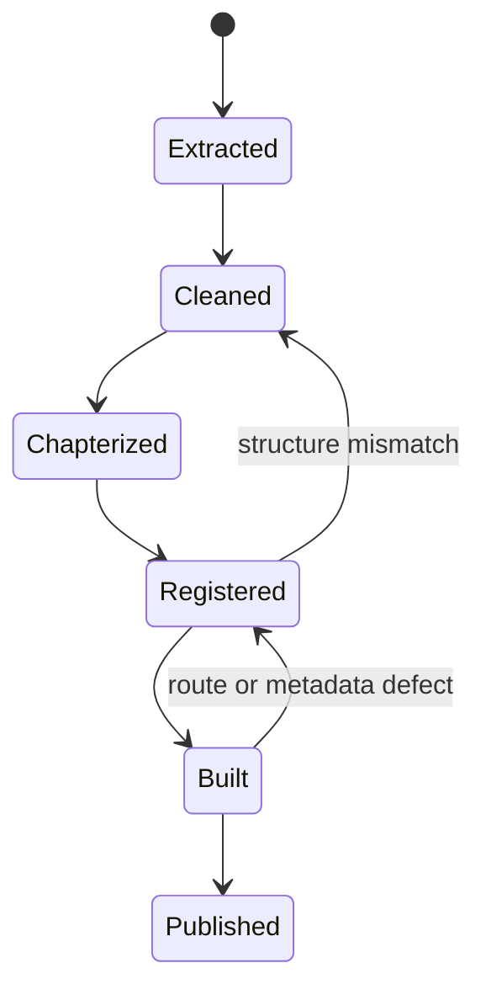
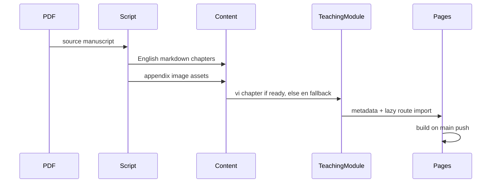

# AGENTS.md

> Guidance for AI agents working on the NhapLuu codebase.

## Project Snapshot
- **App**: NhapLuu (Stream Entry practice companion)
- **Frontend**: React 19 + TypeScript + Vite + Tailwind v4 + shadcn/ui
- **i18n**: `react-i18next` with `src/locales/vi` + `src/locales/en`
- **Backend**: Cloudflare Workers + D1 in `backend/`
- **Routing**: `react-router-dom` in `src/App.tsx`

## Quick Commands
- `npm run dev` — start frontend
- `npm run build` — typecheck + build
- `npm run lint` — lint
- `npm run preview` — preview build

Backend (optional):
- `cd backend && npm run dev` — local Workers
- `cd backend && npm run deploy` — deploy Workers

## Deployment Reality
- Frontend is published by GitHub Pages from this repo's `main` branch via `.github/workflows/deploy.yml`.
- The current git remote points at `git@github.com:cschanhniem/cschanhniem.github.io.git`, so `main` publishes the root Pages site, not a project subpath build.
- Vite `base` is `/`, which matches the current Pages setup.
- Static teaching additions like long-form books do not require a backend deploy unless API behavior changed.

## Repo Map
- `src/pages/` — route-level screens
- `src/components/` — feature + layout components
- `src/components/ui/` — base UI (shadcn)
- `src/hooks/` — app hooks (`useAppState`, `useCheckIn`)
- `src/contexts/` — auth/theme providers
- `src/data/` + `public/data/` — sutta + Nikaya content
- `src/content/teachings/` — long-form manuscript markdown sources
- `public/teachings/` — appendix charts, scanned tables, static teaching assets
- `scripts/` — ingestion utilities and one-off content pipelines
- `design-system.md` + `src/index.css` — design tokens
- `SKILL.md` — manuscript ingestion workflow with diagrams

## UI + UX Conventions
- Use Tailwind + semantic tokens (`bg-card`, `text-foreground`, etc.).
- Follow `design-system.md` for colors/spacing/typography.
- Prefer `lucide-react` icons; add `aria-label` or text labels.
- Keep layouts mindful: generous spacing, minimal distraction.

## i18n Rules
- All user-facing strings should go through `useTranslation()`.
- Update both `src/locales/vi/common.json` and `src/locales/en/common.json`.
- Avoid hard-coded Vietnamese/English strings in components.

## State + Data
- Core state is managed in `useAppState()` and persisted to
  `localStorage` under `nhapluu-app-state`.
- Prefer `useAppState` actions over ad-hoc localStorage writes.
- Reading progress uses `nhapluu_progress_*` keys; keep consistent.

## Long-Form Content
- Prefer chapterized markdown in `src/content/teachings/<slug>/`.
- Keep the site bridge thin: a teaching module should map metadata plus ordered chapter imports.
- When appendix OCR is visibly broken, preserve the source layout as images under `public/teachings/<slug>/`.
- For manuscript ingestion or translation work, read `SKILL.md` before changing the pipeline.
- When a Vietnamese chapter is not yet publication-grade, let the teaching module fall back to English instead of shipping weak prose.

## Book Pipeline Map

## Routing + Navigation
- Add routes in `src/App.tsx`.
- If a page is protected, wrap it in `ProtectedRoute`.
- Update navigation in `src/components/layout/Header.tsx` when adding top-level pages.

## Backend Notes
- API client lives in `src/lib/api.ts`.
- Workers code in `backend/src`.
- D1 schema and migrations live in `backend/schema.sql`.

## Quality Bar
- Run `npm run lint` after meaningful changes.
- Keep TypeScript strict and avoid `any`.
- Maintain accessibility (labels, focus states).

## When You’re Unsure
- Check `README.md`, `design-system.md`, and `docs/codebase-analysis.md`.
