# AGENTS.md

> Guidance for AI agents working on the NhapLuu codebase.

## Project Snapshot
- **App**: NhapLuu (Stream Entry practice companion)
- **Frontend**: React 19 + TypeScript + Vite 8 + Tailwind v4 + shadcn/ui
- **i18n**: `react-i18next` with `src/locales/vi` + `src/locales/en`
- **Backend**: Cloudflare Workers + D1 in `backend/`
- **Routing**: `react-router-dom` in `src/App.tsx`

## Quick Commands
- `npm run dev` — start frontend
- `npm run build` — typecheck + build
- `npm run lint` — lint
- `npm run preview` — preview build

Backend (optional):
- `cd backend && npm run dev` — local Workers
- `cd backend && npm run deploy` — deploy Workers

## Deployment Reality
- Frontend is published by GitHub Pages from this repo's `main` branch via `.github/workflows/deploy.yml`.
- The current git remote points at `git@github.com:cschanhniem/cschanhniem.github.io.git`, so `main` publishes the root Pages site, not a project subpath build.
- Vite `base` is `/`, which matches the current Pages setup.
- Static teaching additions like long-form books do not require a backend deploy unless API behavior changed.

## SEO + Crawlability
- This app is still a client-rendered SPA at runtime, but the build now emits route-level static HTML into `dist/` via `scripts/build-seo-assets.mjs`.
- Treat `src/lib/seo.ts` as the runtime layer and `scripts/build-seo-assets.mjs` as the crawler-facing layer. When route metadata changes, both surfaces must stay coherent.
- `VITE_SITE_URL` must resolve to `https://cschanhniem.github.io` in production. Do not reintroduce the old `/nhapluu` subpath assumptions into canonicals, sitemaps, or robots.
- Public indexable routes must have a generated `dist/<route>/index.html`, canonical URL, sitemap entry, and JSON-LD graph.
- `dist/sitemap.xml` is a sitemap index. Child files are split by route family so coverage remains broad without one oversized flat file.
- Internal or account-scoped routes must stay out of the sitemap and carry `noindex,nofollow`.
- The default social preview asset is `public/og-default.png` at 1200x630. If you replace it, keep the dimensions crawler-safe and update the SEO constants, not scattered tags.
- On GitHub Pages, direct deep links are fragile without static files. If you add a new public route family, wire it into the route generator or search engines will mainly see the 404 redirect shell.

## Performance Hotspots
- Keep the home route lean. Avoid heavyweight charting libraries for small dashboard visuals when plain DOM or SVG is enough.
- Below-the-fold widgets on `/` should not trigger their lazy imports until the section is near view.
- The Nikaya library works over a 12k-item index. Precompute searchable fields once, use deferred search input, and never call expensive lookup helpers repeatedly inside render loops.
- For very large teachings, prefer chapter-level loaders over eager raw markdown imports. One giant `import.meta.glob(..., { eager: true })` can turn a reading route into a multi-hundred-kilobyte JS chunk.
- When doing a speed pass, compare the emitted build chunks before and after. The production output is the truth, not intuition.

## Frontend Build Notes
- Vite 8 uses Rolldown-backed production builds. Treat missing imports and stale chunk config as real build defects, not soft warnings.
- Keep `build.rollupOptions.output.manualChunks` function-based in `vite.config.ts`. The older object-map form no longer matches the stricter Vite 8 typing used here.
- Do not force the `react-markdown` plus `remark` plus `rehype-katex` plus `katex` stack into one manual chunk. Under this build, that split can emit a broken `katex_min_exports` binding and take down the homepage.
- For KaTeX CSS, prefer a lazy `<link rel="stylesheet">` injection from `src/hooks/useKatexCSS.ts` over `import('katex/dist/katex.min.css')`. The CSS-as-module path is fragile under the current Rolldown output.
- `recharts@3.6.0` expects `react-is` as a peer dependency. Keep `react-is` installed explicitly or chart-heavy routes can fail only at production build time.
- `vite-plugin-pwa@1.2.0` and `@tailwindcss/vite@4.x` currently build successfully here, but their npm peer ranges lag behind Vite 8. Re-check upstream support before assuming the warning surface is closed.
- `.npmrc` currently sets `legacy-peer-deps=true` so clean installs keep working while those peer ranges are behind. Remove it once upstream packages officially support Vite 8.

## Repo Map
- `src/pages/` — route-level screens
- `src/components/` — feature + layout components
- `src/components/ui/` — base UI (shadcn)
- `src/hooks/` — app hooks (`useAppState`, `useCheckIn`)
- `src/contexts/` — auth/theme providers
- `src/data/` + `public/data/` — sutta + Nikaya content
- `src/content/teachings/` — long-form manuscript markdown sources
- `public/teachings/` — appendix charts, scanned tables, static teaching assets
- `scripts/` — ingestion utilities and one-off content pipelines
- `design-system.md` + `src/index.css` — design tokens
- `SKILL.md` — manuscript ingestion workflow with diagrams

## UI + UX Conventions
- Use Tailwind + semantic tokens (`bg-card`, `text-foreground`, etc.).
- Follow `design-system.md` for colors/spacing/typography.
- Prefer `lucide-react` icons; add `aria-label` or text labels.
- Keep layouts mindful: generous spacing, minimal distraction.

## i18n Rules
- All user-facing strings should go through `useTranslation()`.
- Update both `src/locales/vi/common.json` and `src/locales/en/common.json`.
- Avoid hard-coded Vietnamese/English strings in components.
- `common` is the default namespace in this repo. Use bare keys like `t('exportPdf')`, not dotted keys like `t('common.exportPdf')`, or the raw key can leak into the UI.

## State + Data
- Core state is managed in `useAppState()` and persisted to
  `localStorage` under `nhapluu-app-state`.
- Prefer `useAppState` actions over ad-hoc localStorage writes.
- Reading progress uses `nhapluu_progress_*` keys; keep consistent.

## Long-Form Content
- Prefer chapterized markdown in `src/content/teachings/<slug>/`.
- Keep the site bridge thin: a teaching module should map metadata plus ordered chapter imports.
- When appendix OCR is visibly broken, preserve the source layout as images under `public/teachings/<slug>/`.
- Treat scanned front matter as its own cleanup pass. If the cover or copyright pages OCR into split capitals, repeated headings, or library stamps, rewrite that section into concise editorial markdown instead of shipping the raw extraction.
- For manuscript ingestion or translation work, read `SKILL.md` before changing the pipeline.
- When a Vietnamese chapter is not yet publication-grade, let the teaching module fall back to English instead of shipping weak prose.
- For short translated essays or retreat handouts, still prefer markdown chapters under `src/content/teachings/<slug>/vi/` over giant inline TypeScript strings.
- Split a new teaching into a few natural chapters when the source has clear turns, even if the source is short.
- Record each teaching release in the repo-root `tasks/` folder so later agents can audit route wiring, source notes, and release intent quickly.

## Book Pipeline Map

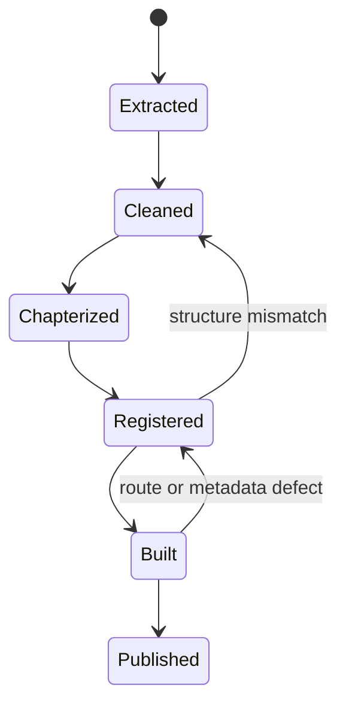

## Frontend Build Pipeline

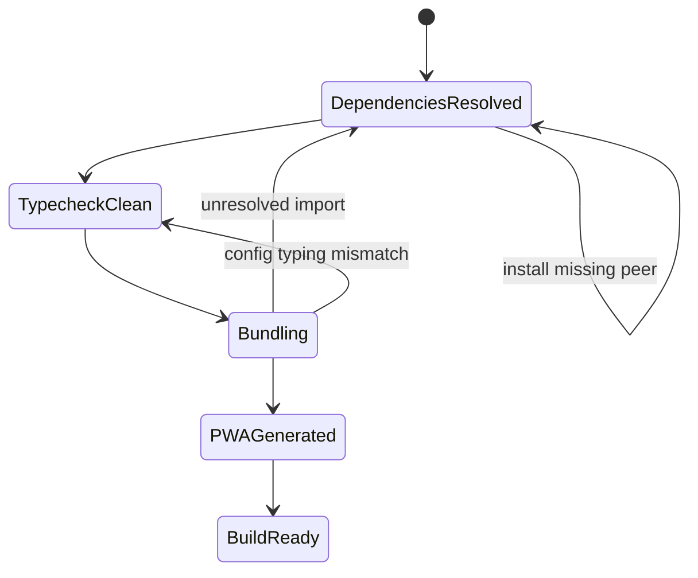

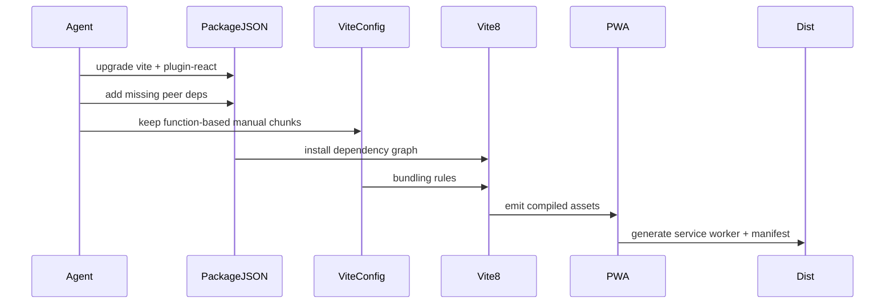

## SEO Build Pipeline

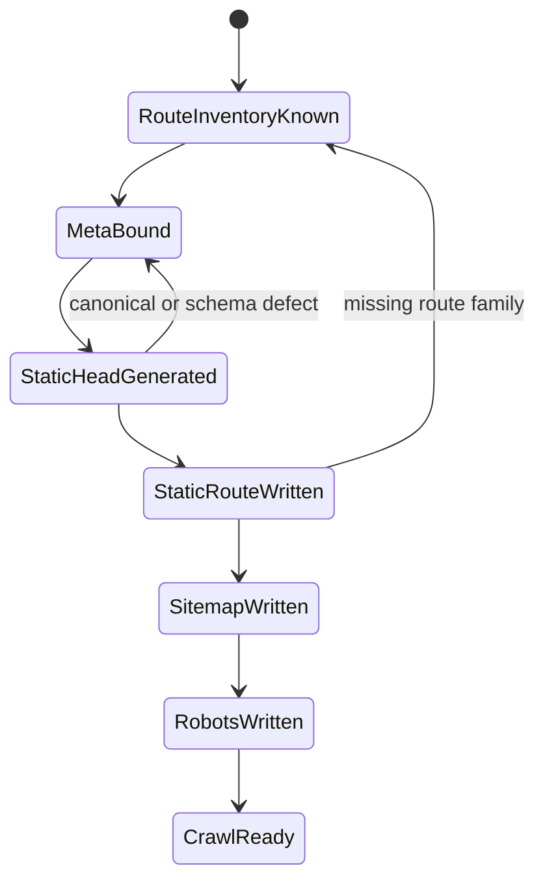

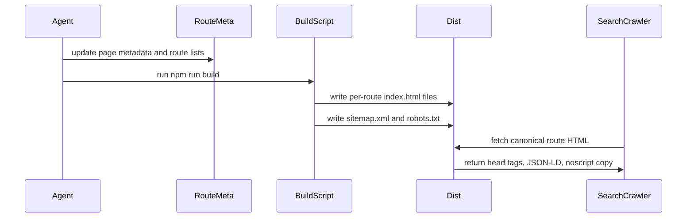

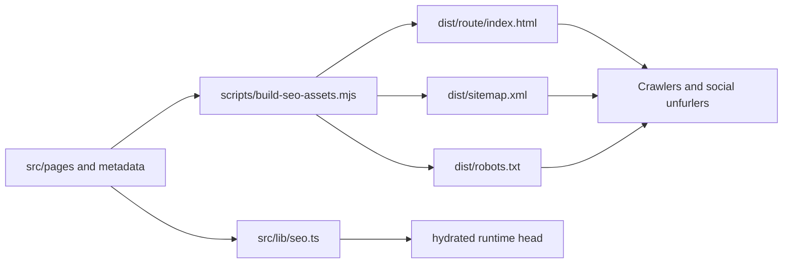

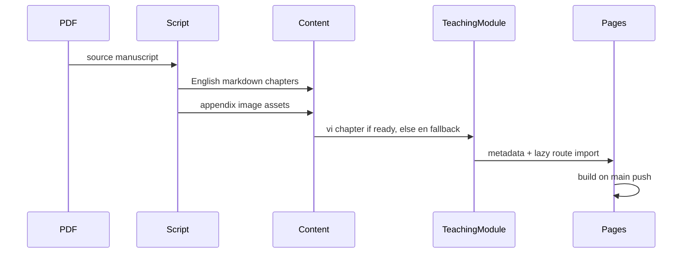

## Routing + Navigation
- Add routes in `src/App.tsx`.
- If a page is protected, wrap it in `ProtectedRoute`.
- Update navigation in `src/components/layout/Header.tsx` when adding top-level pages.
- `Pháp Bảo` is split into two first-class tab routes: `/phap-bao/kinh-tang` and `/phap-bao/giao-phap`. Keep the library tabs URL-driven, not local-state-only.
- Detail pages reached from the library should carry a `state.from` back target and fall back to the correct branch: suttas return to `/phap-bao/kinh-tang`, teachings return to `/phap-bao/giao-phap`.
- `Nikaya` is now branch-driven as well: `/nikaya` for all, `/nikaya/dn|mn|sn|an|kn` for each collection, and `/nikaya/<collection>/<suttaId>` for canonical detail URLs.
- Keep old `/nikaya/<suttaId>` links alive through a redirect route plus static fallback HTML, but do not treat them as canonical or sitemap-worthy.
- `Nikaya` detail links should carry a `state.from` back target and otherwise fall back to their inferred collection branch.
- If you add a new public route namespace, extend `scripts/build-seo-assets.mjs` so the namespace gets static HTML and sitemap coverage.

## Nikaya Collection Routing

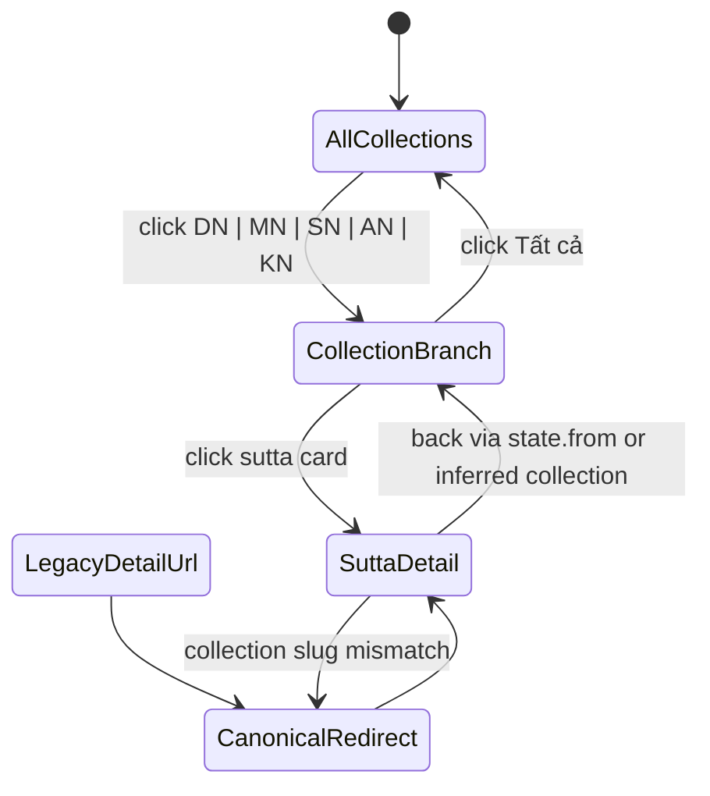

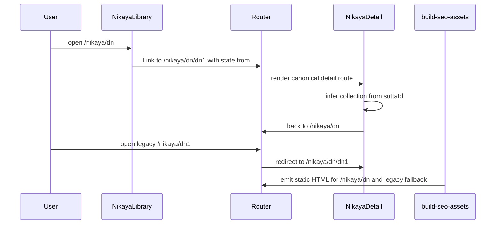

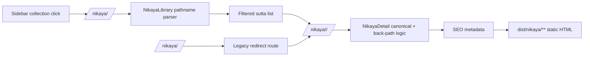

## Nikaya Content Integrity
- Treat `public/data/suttacentral-json/available.json` as file-presence only.
- Treat `public/data/suttacentral-json/content-availability.json` as raw file-level readability only.
- Treat `public/data/suttacentral-json/effective-content-availability.json` as the product-facing truth set. It folds alias children onto readable canonical blocks and is the file UI should use for badges, selectors, and collection-level coverage.
- Treat `public/data/suttacentral-json/canonical-aliases.json` as the route-to-canonical map for fallback loading.
- `src/data/nikaya-improved/vi/*.ts` is the current home of curated manual 2026 Vietnamese translations. These files are editorial content, not raw mirrors of SuttaCentral, and should read like deliberate modern Vietnamese prose.
- Early `AN` child routes can inherit a grouped block title such as `Nữ Sắc v.v…` from `an1.1-10`. When authoring manual 2026 files for exact children like `an1.1` or `an1.7`, name them from the specific `TTC` segment, not from the parent block label.
- `AN 1.11-20` is the first early `AN` block where the child routes form mirrored pairs of hindrance-cause and hindrance-remedy. Keep `an1.11-15` and `an1.16-20` visibly paired in titles and prose so the manual layer preserves the causal symmetry of the source instead of flattening everything into isolated aphorisms.
- `AN 1.21-30` is the next child-level block that must be written as one coherent training cluster, not ten detached sayings. Preserve the three mirrored axes, unworkable and workable, harmful and beneficial, suffering and happiness, and let `an1.25-26` keep the extra English sense of latent potential being unrealized or realized.
- `AN 1.71-81` is another shaped block, not a pile of isolated one-liners. Keep `an1.71-75` as one cluster of training conditions, good friends, wholesome and unwholesome pursuit, and wise or unwise attention. Then keep `an1.76/78/80` and `an1.77/79/81` as two braided triads where kin, wealth, and fame are all relativized under the higher measure of wisdom.
- `AN 1.82-97` is a paired ladder, not a loose peyyala block. The core move is not new doctrine but stronger valuation: each pair upgrades an earlier theme into `great harm` or `great benefit`. Keep the eight pairs visibly matched, and do not leave the Minh Châu peyyala shorthand unexpanded in the manual layer.
- `AN 1.98-139` is the first early `AN` mega-block that changes level midstream. `an1.98-113` repeat earlier factors but now split them into interior and exterior conditions. `an1.114-129` raise the stakes again by tying the same factors to the fading or endurance of the true teaching. `an1.130-139` then leave personal training and move into doctrinal integrity: dhamma versus not-dhamma, vinaya versus not-vinaya, what the Tathāgata did or did not say, practice, or prescribe. Do not flatten those last ten routes into generic moral warnings.
- `AN 1.140-149` is the bright mirror of `AN 1.130-139`. Do not write it as vague praise of honesty. Each route is about doctrinal and disciplinary precision as a merit-bearing act that benefits many beings and makes the true teaching continue. Keep the five paired domains explicit: dhamma, vinaya, speech, practice, and prescription.
- `AN 1.170-187` is not eighteen separate praise-lines about the Buddha. `an1.170-174` establish the singularity of the Tathāgata, `an1.175-186` unfold what becomes possible when he appears, and `an1.187` hands the rolling of the Wheel to Sāriputta. The middle twelve routes are restored from a grouped shell, so do not leave them all with the generic title `Như Lai`.
- `AN 1.31-40` is the first early `AN` block that behaves like a ladder of inner discipline. Keep the sequence visible, tamed, guarded, protected, restrained, and let `an1.39-40` read as true block summaries rather than as redundant restatements.
- `AN 1.41-50` pivots from discipline into orientation, clarity, pliancy, speed, and luminosity. Treat it as one rising arc: right direction, purity, clear seeing, pliable cultivation, then the luminous-mind pair. The closing two suttas are famous and should stay lean, exact, and free of speculative metaphysics not warranted by the source.
- `AN 1.51-60` should be treated as a compact manual on beginnings. It moves from whether one truly sees the luminous mind, to whether even a finger-snap of love counts, to the primacy of intention, then to heedfulness versus laziness. Keep that arc visible instead of making the block feel like unrelated fragments.
- `scripts/generate-nikaya-index.mjs` must generate one index row per local `file id`, not per `suttaplex.uid`. Otherwise the first single route inside a grouped range can vanish from the library and SEO inventory.
- `scripts/generate-nikaya-index.mjs` must treat blank titles as missing metadata. Do not stop at a Vietnamese shell with `translated_title: null` or `translation.title: ''` if the English file or Bilara title segment still contains the real title.
- When top-level metadata is blank, extract the title from the Bilara `sutta-title` segment. Use `html_text` plus `translation_text` for the reader-facing title, and use `root_text` only as a Pali-title fallback when it is meaningful.
- Natural ID ordering matters. Do not use `parseFloat` on composite IDs such as `sn1.10` or `an1.11-20`; use token-aware numeric sorting instead.
- Route normalization must preserve meaningful punctuation in Nikaya IDs. `sn12.72` and `dhp1-20` are canonical route IDs, not strings to compact into `sn1272` or `dhp120`.
- When inferring a Nikaya collection from an ID, test `kp|dhp|ud|iti|snp` before the generic `sn` branch. `snp1.1` is `KN`, not `SN`, and a wrong branch will quietly fetch from the wrong folder.
- Bilara English payloads from `/api/bilarasuttas` are template-based. `html_text` contains one `{}` placeholder per segment and must be composed with `translation_text` before rendering.
- Grouped Bilara canonicals can expose child suttas in two distinct shapes: direct child-prefixed keys such as `an1.2:*`, or canonical-prefixed range sections such as `sn12.72-81:1.1`. Try both scoping strategies before concluding that a child route can only show the whole grouped block.
- Grouped Minh Châu HTML can also expose usable child slices without nested `id="<child>"` elements. After exact IDs and subrange IDs, try `TTC` anchors such as `TTC 3-5` or `TTC 14-17`, but only when the `TTC` ranges cover the full grouped source contiguously from `1..N`. If the labels stop early or skip values, keep the route `opaque-grouped` rather than guessing.
- The remote Bilara fallback in `src/lib/suttacentralApi.ts` also needs token-aware segment sorting. Never sort segment keys like `1.1`, `1.2`, `1.10` with `parseFloat`, or remote fallback prose can arrive out of order.
- For `SN`, and likely other peyyala-heavy collections, do not assume every detail route is a single numeric UID. The library index can contain grouped range IDs such as `sn12.72-81`, and the fetch pass must ingest those exact IDs as first-class local files.
- Many `SN`, `AN`, and `KN` local files are alias files where `suttaplex.uid !== file id`. Treat these as a real data-shape concern, not a parsing bug.
- Bilara may respond with HTTP `200` and a body like `{"msg":"Not Found"}` for missing English routes. Treat that as absent content, not a success.
- `KN` detail routes use book-specific prefixes such as `kp`, `dhp`, `ud`, `iti`, and `snp`. Any route inference or local file resolver that only keys off `dn|mn|sn|an|kn` prefixes is incomplete.
- Current sampled `KN` local JSON is metadata-only. Do not mark `KN` as content-complete unless the files actually contain readable body text or segment maps.
- `npm run audit:nikaya-originals` is the canonical audit for original layers. It distinguishes file presence, readable content, alias UID drift, alias-target validity, alias-range validity, range completeness inside grouped canonicals, route-title parity, Pali-title parity, and whether a readable Vietnamese source is truly Minh Châu or only a mislabeled placeholder.
- The same audit also distinguishes topology defects from semantic duplication. `SN` and `AN` currently index both grouped canonicals and their child aliases, while `KN` has child aliases for Dhammapada ranges without indexing the grouped canonicals.
- `Alias range violations` and `range completeness violations` should both stay at `0`. If a grouped canonical such as `sn12.72-81` or `dhp1-20` is missing any child route or contains an unexpected extra child, treat that as a topology defect even if the canonical itself exists.
- Run `npm run audit:nikaya-coverage` when you need the product-facing truth set by canonical block. It tells you which canonical blocks are fully readable in both languages, which are missing only English, which are missing only Vietnamese, which rely on canonical fallback, and which have missing canonical targets.
- Run `npm run audit:nikaya-master` when you want one consolidated report that merges structure, provenance, topology, and canonical-block coverage into a single per-collection summary.
- In `KN`, many files named `*_vi_minh_chau.json` are not usable Minh Châu content. Some resolve only to metadata, and a large grouped subset points to `phantuananh` in `suttaplex.translations`. Do not count those as Minh Châu coverage unless the file is both readable and source-matched.
- The `KN` grouped Dhammapada canonicals such as `dhp1-20` and `dhp21-32` are now indexed locally. Their English can be loaded directly on the grouped route and inherited by the child `dhp*` routes through `canonical-aliases.json`.
- `npm run audit:nikaya` now uses `effective-content-availability.json`, so its totals reflect what a reader can actually open from the current UI, not just which single JSON files contain raw text on their own.
- `npm run audit:nikaya-remote` probes the official SuttaCentral APIs for every canonical coverage gap and classifies each one as `readable`, `metadata-only`, `not found`, `http error`, or `network error`. Use it before concluding that a local gap is truly upstream.
- `npm run audit:nikaya-remote` now has two lanes: `canonical` gaps and `visible-route` gaps. The second lane is critical for cases like `an1.330-332`, where the canonical block is readable but the public child routes are still missing.
- `npm run audit:nikaya-master` now carries the upstream lane as well, but a nonzero `network-error` count means the remote truth set is inconclusive, not empty. Do not read `0/0/0` plus `network-error > 0` as upstream completeness.
- In any Bilara or legacy segment scanner, never count metadata keys such as `uid`, `lang`, `title`, `author`, `previous`, or `next` as readable segments. Only keys with `:` belong to segment content, with an explicit `text` field as the rare direct-text exception.
- `npm run audit:nikaya-fidelity` is the route-level truth set for rendering quality on the visible library surface. Use it to separate `exact`, `scoped-grouped`, `opaque-grouped`, and `missing` originals for English and Minh Châu.
- Nikaya alias routes often need local metadata fallback even when remote `suttaplex` exists. For routes such as `sn12.72` and `dhp1`, prefer the child row in `nikaya_index.json` for `uid`, acronym formatting, titles, and blurb when grouped canonical JSON or remote metadata is blank.
- The public Nikaya library should not double-list grouped canonical fallback rows such as `sn12.72-81` or `dhp1-20`. Keep them in the raw index for fallback resolution and audits, but hide them from the visible library list and user-facing collection totals.
- Apply the same rule to SEO. Grouped canonical fallback rows should keep working as direct routes, but they must stay off the indexable surface: no sitemap entry, and `noindex,nofollow` in both static HTML and runtime head tags.
- When remote audit proves a language layer is readable upstream but still missing locally, use `node scripts/fetch-all-nikayas.mjs repair <collection> <en|vi>`. That mode refetches only files that still lack curated readable content and skips child alias routes already satisfied by a canonical fallback.
- After the current repair pass, `KN` is English-complete on the public surface. Remaining `KN` deficits are now entirely Vietnamese provenance and manual 2026 coverage, not English ingestion.
- Do not mark a Nikaya version as selectable based only on SuttaCentral metadata. If the local rendered content is absent, disable the option and fall back to SuttaCentral as an external link only.
- When a route can only render an original layer as a whole grouped block, surface that fact in the reader. `NikayaDetail` and `NikayaComparisonView` should distinguish a clean single-sutta render from a grouped fallback instead of silently implying exact coverage.
- Treat `src/lib/nikaya-source-gaps.ts` as the registry of verified original-layer absences. Use it only after source inspection has proven the gap is real, as with `sn36.30`, `AN 11.*`, or English `an1.330-332`.
- Do not fabricate Minh Châu source text for peyyala routes that do not exist in the verified edition. Once a gap is proven real, surface a source-gap notice in the reader instead of inventing filler content.
- The Nikaya detail selector is intentionally curated to three choices only: `Tiếng Việt - Thích Minh Châu`, `Tiếng Anh - Bhikkhu Sujato`, and `Tiếng Việt - Nhập Lưu 2026`. Do not surface other languages or author variants in the UI unless product scope changes.
- `npm run audit:nikaya` derives manual 2026 coverage from `src/data/nikaya-improved/vi/*.ts`. Preserve dotted IDs when normalizing filenames such as `sn-56-11.ts`, or the audit will silently undercount curated translations.
- For collection triad audits, run `npm run audit:nikaya -- <dn|mn|sn|an|kn>`. Keep `npm run audit:nikaya-dn` only as a DN shortcut.
- For structural audits, run `npm run audit:nikaya-integrity` before trusting collection totals or SEO route counts.
- For provenance and readability audits of the original English plus Minh Châu layers, run `npm run audit:nikaya-originals [dn|mn|sn|an|kn]`.
- When authoring manual 2026 translations, keep the source argument intact, trim repetition when it only echoes earlier stock passages, and make the Vietnamese readable aloud without flattening the doctrine.
- For `SN` manual 2026 authoring, prefer a doctrinal spine batch across major saṃyuttas before filling long consecutive stretches. Core anchors such as dependent origination, not-self, the burning discourse, satipaṭṭhāna conditions, and the truths make later style decisions more coherent.
- The current `SN` doctrinal spine now includes `sn12.1`, `sn12.2`, `sn12.12`, `sn12.15`, `sn22.22`, `sn22.59`, `sn22.95`, `sn35.23`, `sn35.28`, `sn35.63`, `sn45.8`, `sn46.51`, `sn47.13`, `sn47.42`, `sn48.10`, `sn55.1`, `sn56.1`, `sn56.11`, and `sn56.13`. When extending `SN`, keep choosing leverage points like these instead of scattering effort over arbitrary contiguous ranges.
- For `KN` manual 2026 authoring, `Khuddakapāṭha` is the best first foothold. Translate `kp1-kp9` as a coherent liturgical cluster before expanding into broader `KN` books, and keep chant bodies intact instead of flattening them into summaries.
- After `kp1-kp9`, the next `KN` foothold should be the source-supported `Sutta Nipāta` anchors `snp1.8`, `snp2.4`, and `snp3.7`. The first two overlap with `Mettā` and `Maṅgala`, so keep their route-level identity while preserving a chantable cadence. `Sela` should be treated as a narrative-conversion discourse, not reduced to a generic praise summary.
- `DN` manual 2026 coverage is now complete at `34/34`. Future `DN` changes should normally be editorial revision passes, fidelity improvements, or prose tightening, not missing-file backfill.
- `MN` manual 2026 coverage is now complete at `152/152`. For `MN`, future work should focus on editorial upgrades to specific discourses rather than missing-file backfill.
- `src/data/nikaya-improved/vi/index.ts` now auto-discovers translation modules with `import.meta.glob`. Do not hand-maintain a giant import registry for manual 2026 files anymore.
- `src/data/nikaya-improved/availability.ts` is derived from `viImproved`. Treat it as generated-from-source structure, not a second manual truth table.
- Use `node scripts/generate-manual-2026.mjs <dn|mn|sn|an|kn>` or `npm run generate:manual -- <collection>` to scaffold missing manual 2026 files. The script skips existing files, preserves curated hand-edited modules, and writes filenames in canonical hyphenated form such as `mn-6.ts`, `an-1-10.ts`, or `sn-56-11.ts`.
- `docs/manual-2026-agent-prompts.md` is the canonical prompt pack for AI-assisted manual 2026 authoring. Use it when handing batch translation or editorial revision work to another agent.
- In that prompt pack, keep the source hierarchy explicit: English locks meaning, HT. Thích Thanh Từ sharpens Vietnamese clarity and cadence when the source is truly available, and HT. Thích Minh Châu remains the local terminology and route-structure cross-check. Never claim Thanh Từ input if the source packet is absent from the workspace.
- `worklog-translate-2026.md` is the top-level tracker for manual 2026 coverage. Update it after every translation batch with the active lane, completed-through route, next missing route, and latest coverage counts.
- `AN 1.188-197` is a short but precise cluster of foremost disciples. Do not flatten it into generic praise. Each route should retain the distinct excellence being named, and `an1.197` must read like a charter for faithful commentary: expanding a brief statement without distortion.
- `AN 1.198-208` is the next disciples cluster, but its center of gravity shifts from public distinction to interior capacities and support conditions. Keep `an1.198-200` technically exact without turning them into occult spectacle, keep `an1.201-206` as a quiet arc of communal beauty, no strife, worthy of offerings, forest dwelling, absorption, energy, and good speech, and keep `an1.207-208` from collapsing into crude ideas of luck or blind belief. Sīvali is about mature merit, and Vakkalī is about faith that leans the whole life toward truth.

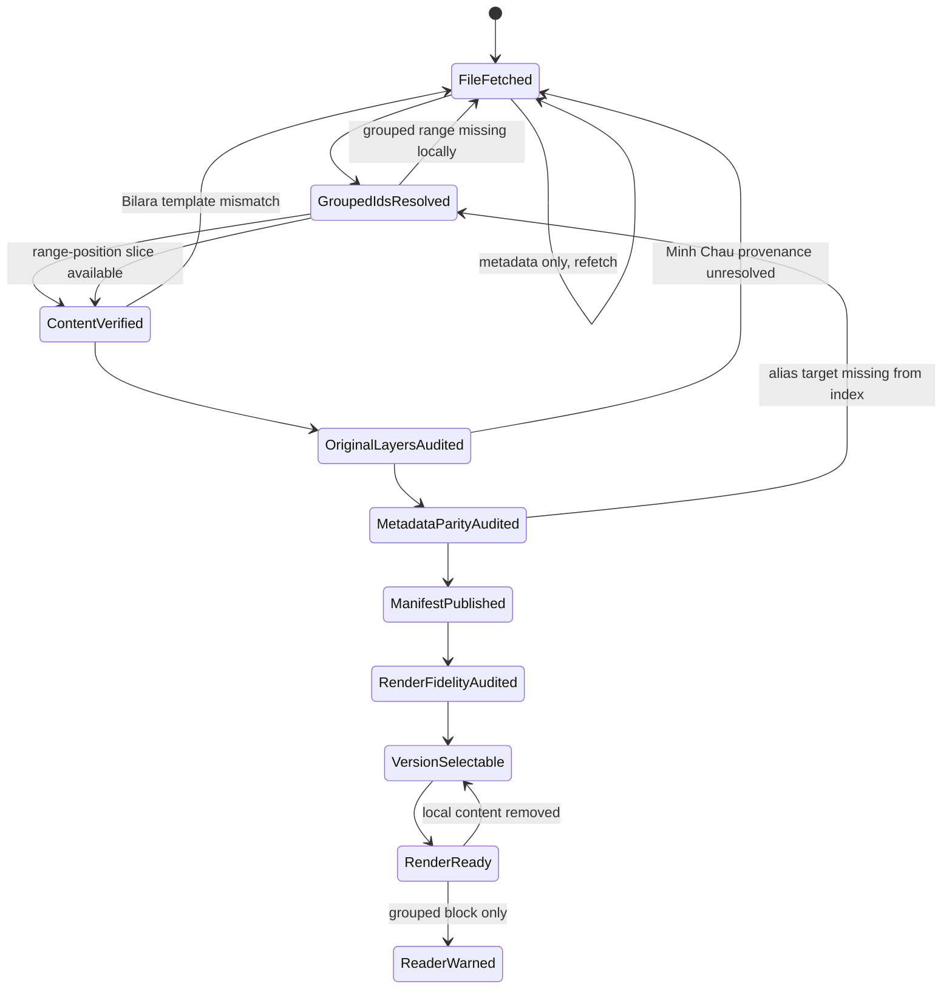

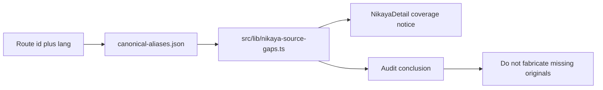

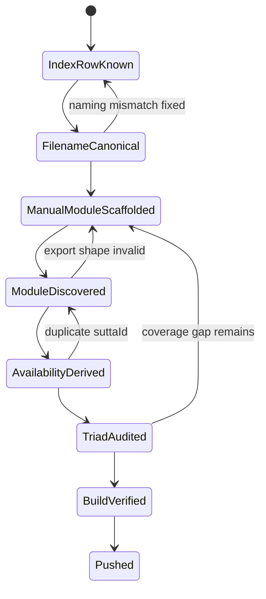

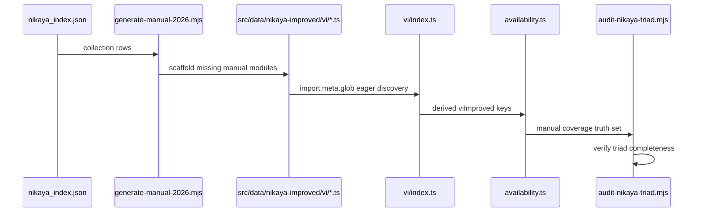

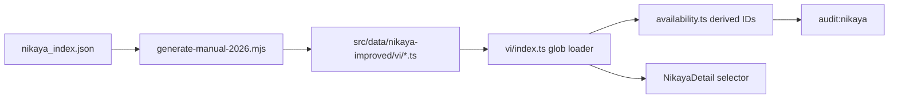

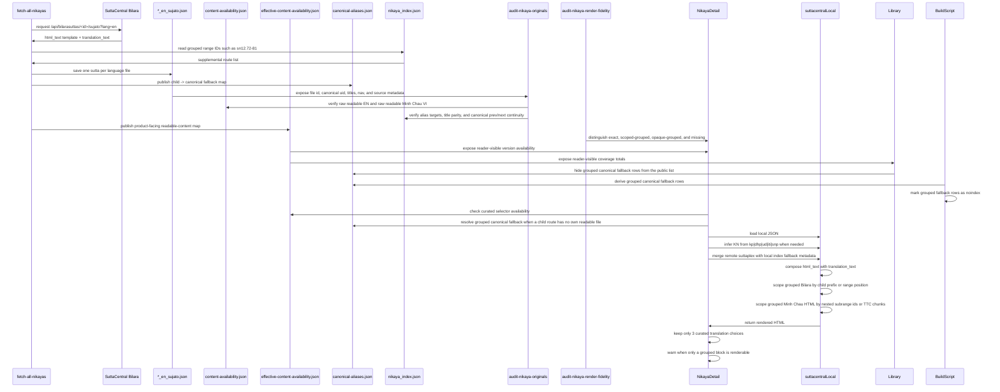

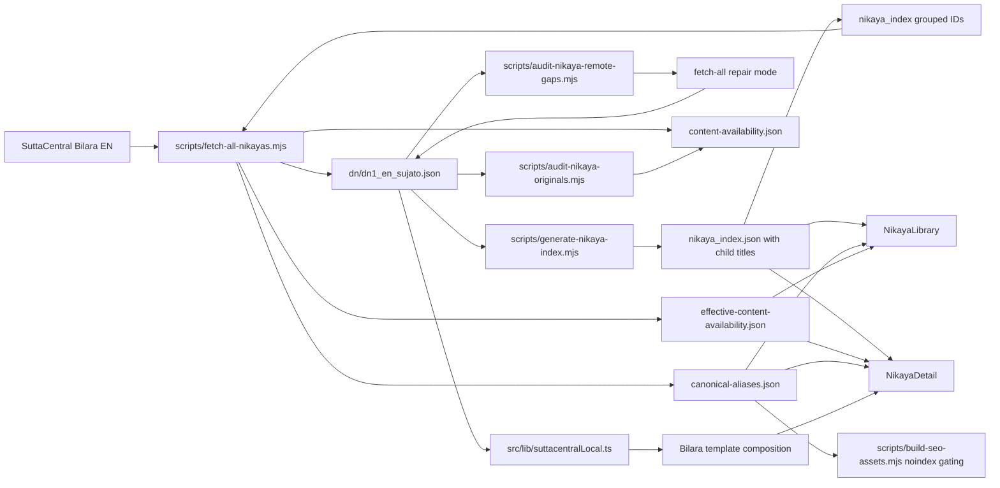

## Backend Notes
- API client lives in `src/lib/api.ts`.
- Workers code in `backend/src`.
- D1 schema and migrations live in `backend/schema.sql`.

## Quality Bar
- Run `npm run lint` after meaningful changes.
- Keep TypeScript strict and avoid `any`.
- Maintain accessibility (labels, focus states).

## When You’re Unsure
- Check `README.md`, `design-system.md`, and `docs/codebase-analysis.md`.
