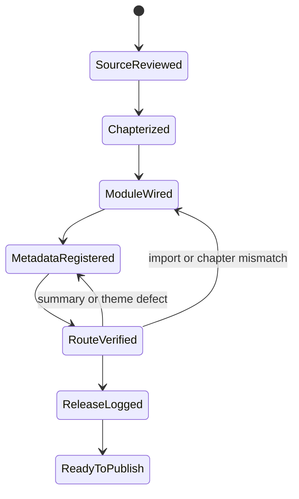
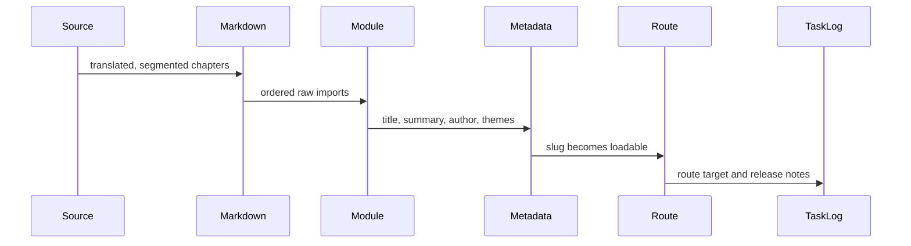
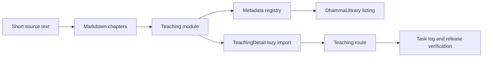
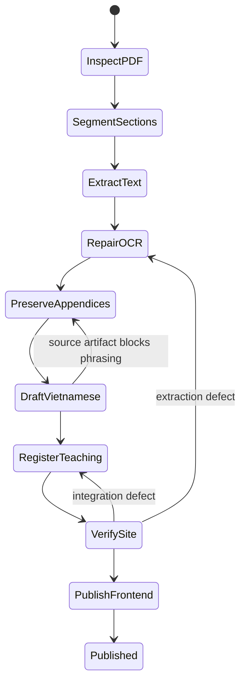
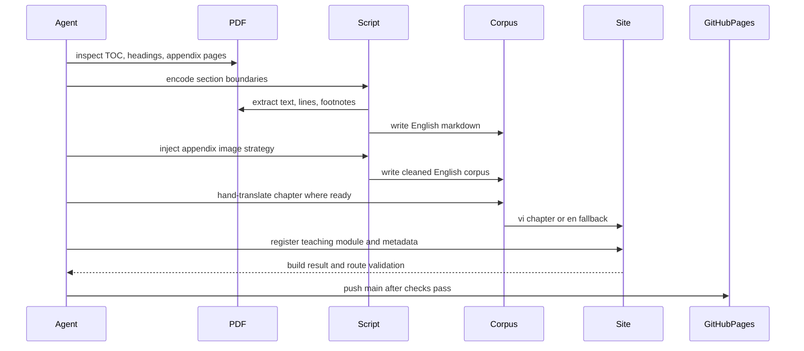
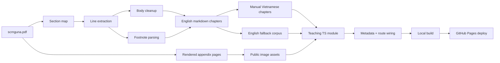

# Long-Form Manuscript Ingestion

This skill documents the house method for turning a long PDF manuscript into site-ready teaching content without losing structure, citations, appendix material, or release discipline.

## When To Use It

Use this workflow when a source PDF is long, citation-heavy, or contains tables and diagrams that cannot survive plain OCR.

## Canonical Paths

- Source PDF: repo root or task-specific import path.
- Extraction script: `nhapluu-app/scripts/ingest_scrnguna.py`
- English corpus: `nhapluu-app/src/content/teachings/<slug>/en/`
- Vietnamese corpus: `nhapluu-app/src/content/teachings/<slug>/vi/`
- Appendix assets: `nhapluu-app/public/teachings/<slug>/`
- Site module: `nhapluu-app/src/data/teachings/<slug>/`

## Workflow

1. Inspect the PDF structure first.
2. Define section boundaries manually when the table of contents is reliable.
3. Extract body text and footnotes separately.
4. Repair OCR only where the errors are patterned and repeatable.
5. Replace broken appendix OCR with image-backed markdown when layout matters.
6. Draft or translate Vietnamese chapters carefully, chapter by chapter.
7. Keep English chapters as the canonical fallback for unfinished Vietnamese sections.
8. Build a small TypeScript bridge that imports chapter markdown into the site’s teaching model.
9. Verify build output and inspect the public page.
10. Publish the frontend by pushing `main` when the route is stable.

## Short-Form Translation Release

Use this lighter branch when the source is a retreat handout, a short essay, or a single translated talk that does not need OCR repair or appendix preservation.

1. Segment the piece into 3 to 6 markdown chapters if the source has natural shifts.
2. Store the text under `src/content/teachings/<slug>/vi/`.
3. Build a thin manifest bridge in `src/data/teachings/<slug>/index.ts`.
4. Register metadata in `src/data/teachings/metadata.ts`.
5. Add the slug to the lazy import map in `src/pages/TeachingDetail.tsx`.
6. Write a release log in the repo-root `tasks/` folder with source note and route target.
7. Run `npm run build` and `npm run lint` before calling the route ready.

### State Machine

### Sequence

### Data Flow

## State Machine

## Sequence

## Data Flow

## Practical Rules

- Never trust automatic footnote placement on biography or front-matter pages. Only annotate numbers that actually exist as page footnotes.
- Run a dedicated front-matter QA pass. Cover pages, title pages, and library stamps often OCR into duplicated headings, isolated capitals, and other debris that must be rewritten into clean editorial prose before publication.
- Do not flatten tables or diagrams into broken prose. Preserve them as images with short textual summaries.
- Keep chapter files stable across reruns by using explicit numeric prefixes in filenames.
- Protect Pāli doctrinal vocabulary when translating. A bad translation of a key term is worse than leaving the term in transliteration.
- Treat the English markdown as the canonical extracted source.
- If the Vietnamese chapter is not yet elegant, doctrinally precise, and readable aloud, do not force publication. Let the module fall back to English.
- For this repo, a content-only release normally means frontend publish only.
- Site verification now runs on Vite 8. Keep `manualChunks` function-based in `vite.config.ts`, and if chart routes fail under production bundling, confirm `react-is` is installed for `recharts`.
- During route QA, inspect the page chrome as well as the manuscript body. Mis-scoped i18n keys such as `t('common.exportPdf')` can surface raw keys even when the content itself is clean.

## Review Checklist

- Section ordering matches the source PDF.
- Page-scoped footnote labels are unique.
- No obvious split-word artifacts remain around footnote markers.
- Appendix pages render upright and at readable width.
- Metadata title, summary, difficulty, and themes match the manuscript.
- The teaching route resolves with chapter ordering intact.
- Site build passes after wiring.
- Pages deploy is triggered from `main`.
