# Long-Form Manuscript Ingestion

This skill documents the house method for turning a long PDF manuscript into site-ready teaching content without losing structure, citations, appendix material, or release discipline.

## When To Use It

Use this workflow when a source PDF is long, citation-heavy, or contains tables and diagrams that cannot survive plain OCR.

## Canonical Paths

- Source PDF: repo root or task-specific import path.
- Extraction script: `nhapluu-app/scripts/ingest_scrnguna.py`
- English corpus: `nhapluu-app/src/content/teachings/<slug>/en/`
- Vietnamese corpus: `nhapluu-app/src/content/teachings/<slug>/vi/`
- Appendix assets: `nhapluu-app/public/teachings/<slug>/`
- Site module: `nhapluu-app/src/data/teachings/<slug>/`

## Workflow

1. Inspect the PDF structure first.
2. Define section boundaries manually when the table of contents is reliable.
3. Extract body text and footnotes separately.
4. Repair OCR only where the errors are patterned and repeatable.
5. Replace broken appendix OCR with image-backed markdown when layout matters.
6. Draft or translate Vietnamese chapters carefully, chapter by chapter.
7. Keep English chapters as the canonical fallback for unfinished Vietnamese sections.
8. Build a small TypeScript bridge that imports chapter markdown into the site’s teaching model.
9. Verify build output and inspect the public page.
10. Publish the frontend by pushing `main` when the route is stable.

## Short-Form Translation Release

Use this lighter branch when the source is a retreat handout, a short essay, or a single translated talk that does not need OCR repair or appendix preservation.

1. Segment the piece into 3 to 6 markdown chapters if the source has natural shifts.
2. Store the text under `src/content/teachings/<slug>/vi/`.
3. Build a thin manifest bridge in `src/data/teachings/<slug>/index.ts`.
4. Register metadata in `src/data/teachings/metadata.ts`.
5. Add the slug to the lazy import map in `src/pages/TeachingDetail.tsx`.
6. Write a release log in the repo-root `tasks/` folder with source note and route target.
7. Run `npm run build` and `npm run lint` before calling the route ready.

## Route SEO Release Checks

Use this pass whenever a content release adds or changes a public route. The site now depends on a build-time SEO layer in addition to the client-side metadata hook.

1. Confirm the route has a unique title, summary, and canonical path.
2. Confirm the route family is represented in `scripts/build-seo-assets.mjs`.
3. Run `npm run build` so the generator writes static HTML, sitemap, and robots artifacts.
4. Inspect at least one generated file under `dist/<route>/index.html`.
5. Verify the route appears in the appropriate child sitemap referenced by `dist/sitemap.xml` if it is public.
6. Verify account or tool surfaces are excluded from the sitemap and carry `noindex,nofollow`.
7. Keep the default social image crawler-safe. Use the shared `og-default.png` unless the route genuinely warrants a bespoke asset.

## URL-Driven Library Branch Release

Use this pass when a library filter stops being local UI state and becomes a canonical branch route, as with `Nikaya` collection pages.

1. Move the filter source of truth from component state to pathname parsing.
2. Give each branch a stable collection URL and each detail page a canonical nested URL.
3. Preserve old detail URLs with a redirect route and static fallback HTML when direct deep links may already exist.
4. Pass `state.from` from listing to detail so back navigation lands on the right branch.
5. Update runtime metadata and build-time SEO enumeration together. Treat either half drifting out of sync as a release defect.
6. Verify branch pages are indexable only when they are canonical. Legacy redirect surfaces should be `noindex`.

### Branch State Machine

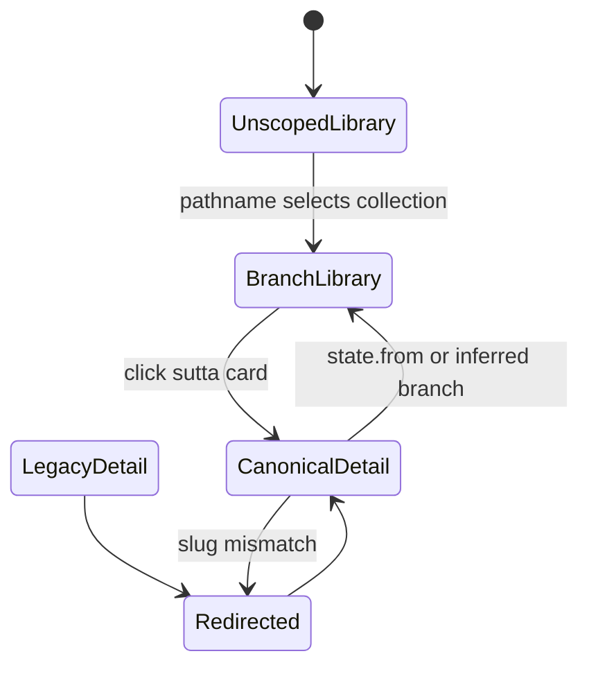

### Branch Sequence

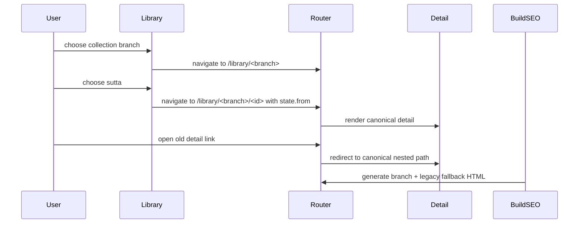

### Branch Data Flow

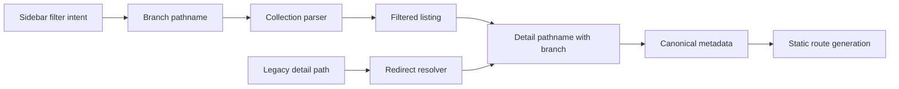

### SEO State Machine

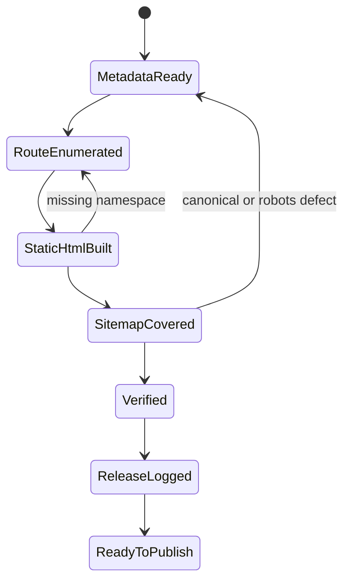

### SEO Sequence

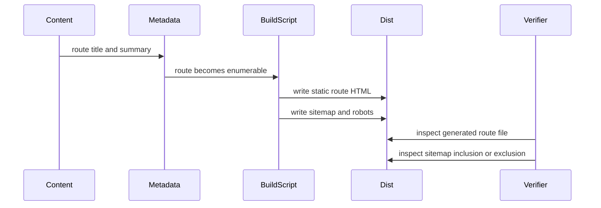

### SEO Data Flow

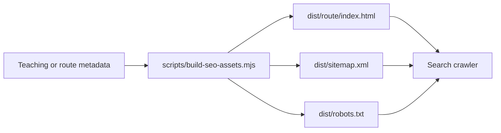

## Nikaya Sutta Data QA

Use this branch when Nikaya detail pages show placeholder prose, raw Bilara templates, or version options that claim to exist without readable content.

1. Inspect one affected local file under `public/data/suttacentral-json/<collection>/`.
2. Distinguish file presence from readable content. `available.json` is not enough for UI truth.
3. If the English payload comes from Bilara, inspect `html_text`, `translation_text`, `root_text`, and `keys_order`.
4. Compose Bilara `html_text` templates with `translation_text` before rendering. Do not render raw `{}` placeholders.
5. Publish raw file readability into `content-availability.json`, product-facing route readability into `effective-content-availability.json`, and child-to-canonical fallback routing into `canonical-aliases.json`.
6. Keep the Nikaya selector limited to the curated 3-option set: `Tiếng Việt - Thích Minh Châu`, `Tiếng Anh - Bhikkhu Sujato`, and `Tiếng Việt - Nhập Lưu 2026`.
7. Within that curated set, keep disabled any option that lacks local readable content.
8. Audit collection triad readiness with `npm run audit:nikaya -- <dn|mn|sn|an|kn>`.
9. If the collection is `SN` or another peyyala-heavy branch, inspect `nikaya_index.json` for grouped range IDs such as `sn12.72-81` and fetch those exact IDs too.
10. Treat Bilara `200 {"msg":"Not Found"}` responses as missing English, not success.
11. For `KN`, remember that collection inference must map `kp`, `dhp`, `ud`, `iti`, and `snp` into the `kn` folder, and that this check must happen before any generic `sn` prefix logic.
12. Verify one collection route and one detail route in a browser after the patch.
13. For `manual 2026` authoring, store the copy in `src/data/nikaya-improved/vi/*.ts` as curated markdown, keep the doctrinal structure intact, and use modern Vietnamese that still sounds disciplined when read aloud.
14. A `manual 2026` file is only complete when it contains the full translation body of the route itself. Short commentary shells or note-style outlines are drafts, not final deliverables.
15. Do not use `Mũi kinh`, `Điều bài kinh muốn chỉ ra`, `Bài học thực hành` as the main architecture of the final translation. At most, keep one short framing note before or after a full translated body.
16. For peyyāla and grouped shorthand routes, expand the body into a route-complete translation. Do not hide missing expansion behind a compact paraphrase.
14. For early `AN` child routes inside grouped `TTC` blocks, do not reuse the parent block title for every child. Name exact routes like `an1.1` and `an1.10` from their own segment content, or the manual layer will look structurally wrong even if the grouped fallback still renders.
15. `AN 1.11-20` adds one more constraint for those early grouped blocks: the child routes come in mirrored pairs. Write `an1.11-15` as the causes that let hindrances arise and `an1.16-20` as the remedies that prevent or abandon them, so the reader can feel the symmetry built into the source.
16. `AN 1.21-30` should be handled as a mind-training cluster. Keep the prose aware of the full sequence, unworkable and workable, harmful and beneficial, suffering and happiness, and do not lose the English nuance of unrealized and realized potential in `an1.25-26`.
17. `AN 1.71-81` must be treated as a shaped editorial unit. `an1.71-75` form a conditions-of-training cluster, good friends, what one pursues, and wise or unwise attention. `an1.76-81` then split into two interlaced triads about loss and growth, where relatives, wealth, and fame are all subordinated to the single higher metric of wisdom. Do not flatten these into generic motivational sayings.
18. `AN 1.82-97` is another high-structure block. Its eight pairs all repeat known themes, but the editorial center of gravity is the stronger verdict `very harmful` versus `very beneficial`. Write the manual layer so that readers can feel this escalation, and restore full route-level clarity where the Minh Châu source uses peyyala shorthand like `như số 1/2, chỉ thế vào ...`.
19. `AN 1.98-139` is a three-stage editorial unit. First comes the interior-versus-exterior framing, then the same factors are re-read as causes for the true teaching to fade or endure, and finally the block turns into a doctrinal-integrity warning about mislabeling dhamma, vinaya, the Tathāgata's speech, practice, and prescriptions. The last ten routes must sound like safeguards of transmission, not like generic self-help advice.
20. `AN 1.140-149` is the restoration mirror of the previous integrity block. The prose must feel affirmative but still exacting: calling not-dhamma not-dhamma, dhamma dhamma, and so on is not bland correctness, it is a communal act of merit that protects transmission. Keep the five integrity domains sharply separated so the reader can hear what exactly is being preserved.
17. `AN 1.31-40` should read like a ladder of discipline around the same mind: untamed and tamed, unguarded and guarded, unprotected and protected, unrestrained and restrained. Let `an1.39-40` gather the whole ladder back together so the block closes with structural force.
18. `AN 1.41-50` needs a different editorial rhythm. Keep the sequence as an arc from direction to destiny, then from clarity to pliancy, then into the luminous-mind pair. `an1.49-50` especially should stay sparse and exact; clarify the practical point, but do not load those two short suttas with extra doctrine that the source itself does not say.
19. `AN 1.51-60` is another mixed block that still needs one spine. Read it as a sequence from seeing the luminous mind rightly, to the dignity of even a finger-snap of mettā, to intention as the lead factor, then heedfulness and laziness. Keep `an1.53-55` distinct at the level of verbs, arise, develop, direct, even though the formula is nearly identical.
20. Before trusting Nikaya totals, run `npm run audit:nikaya-integrity`. It checks index parity, manifest parity, ordering defects, misplaced files, and alias IDs where `suttaplex.uid !== file id`.
21. Run `npm run audit:nikaya-originals` when you need the stronger truth set for English plus Minh Châu: file presence, readable body text, alias UID drift, alias-target validity, alias-range validity, grouped-range completeness, title parity, Pali-title parity, canonical `previous/next` continuity, and whether a readable Vietnamese source is genuinely Minh Châu.
22. In `KN`, do not trust the `*_vi_minh_chau.json` suffix by itself. A large metadata-only subset actually points to `phantuananh` or to no Vietnamese source metadata at all.
23. When regenerating `nikaya_index.json`, sort IDs with token-aware numeric ordering and keep one row per local file id. Do not let grouped `suttaplex.uid` swallow a real single route such as `an1.100` or `sn12.100`.
24. Preserve canonical punctuation in route IDs. `sn12.72` must stay `sn12.72`; do not normalize it into `sn1272` just to share a lookup helper with compact manual-translation keys.
25. `KN` grouped Dhammapada canonicals such as `dhp1-20` are now part of the local index. If English appears missing on a child `dhp*` route, check `canonical-aliases.json` and verify the grouped canonical file was fetched.
26. Treat route topology as its own truth set. `SN` and `AN` currently include both grouped range routes and all child alias routes, which is semantic duplication but not missing content. `KN` now also has grouped canonicals, so its `dhp*` children should inherit English via canonical fallback instead of looking missing.
27. Keep `alias range violations` and `range completeness violations` at `0`. A grouped canonical is not healthy if it exists in the index but silently drops child IDs or absorbs unexpected ones.
28. Use `effective-content-availability.json` for UI-facing totals and `content-availability.json` for raw file-level audits. Do not mix them up.
29. Run `npm run audit:nikaya-coverage` when the user asks the practical question, “bài nào thật sự đọc được bằng English và Minh Châu?” This matrix works at the canonical-block level and separates fallback-only aliases from genuinely missing English, genuinely missing Vietnamese, and missing canonical routes.
30. Run `npm run audit:nikaya-master` when you need the full executive summary in one place. It merges the raw file audit and the canonical coverage matrix so you can answer “đúng thứ tự chưa, thiếu gì, thừa gì, sai gì” without manually reconciling multiple reports.
31. On alias detail routes, do not trust remote `suttaplex` metadata to be complete. Merge it with local fallback metadata derived from `nikaya_index.json`, and prefer the child row over any grouped canonical row for acronym, titles, and blurb.
32. In the public Nikaya library, hide grouped canonical fallback rows such as `sn12.72-81` or `dhp1-20`. Keep them in the raw index for fallback resolution and audits, but do not expose them beside child routes in the main reader-facing list.
33. Apply that same grouping rule to SEO. Grouped canonical fallback rows should remain directly openable, but they should be omitted from indexable sitemaps and carry `noindex,nofollow` in both static HTML and runtime page metadata.
34. When regenerating `nikaya_index.json`, reject blank titles as real metadata. If `suttaplex.translated_title` or `translation.title` is empty, keep falling through to English and then to the Bilara `sutta-title` segment.
35. In that Bilara fallback, derive the visible title from `translation_text` and only use `root_text` as a Pali-title fallback when it is not just `~`.
36. When a triad audit reads `src/data/nikaya-improved/vi/*.ts`, normalize filenames like `sn-56-11.ts` back to `sn56.11`. Do not flatten dotted IDs away, or manual 2026 coverage will be undercounted.
37. Token-sort Bilara segment keys in both local and remote fallbacks. Any helper that uses `parseFloat('1.10')` on segment suffixes will scramble discourse order when the route falls back to the live API.
38. Run `npm run audit:nikaya-remote` when you need proof from the official source. It now reports both `canonical` gaps and `visible-route` gaps, so cases like `an1.330-332` do not disappear behind a readable canonical block. If the result is `network error`, rerun with real network access before concluding that the upstream source is silent.
39. If remote audit says the source is readable upstream but the local layer is still missing, run `node scripts/fetch-all-nikayas.mjs repair <collection> <en|vi>`. That mode refetches only unreadable curated originals and skips child aliases already covered by canonical fallback.
40. After the current repair pass, `KN` should be treated as English-complete on the public reader surface. Do not keep describing `KN` as English-deficient unless a later audit shows regression.
41. Run `npm run audit:nikaya-fidelity` when the user asks whether a visible route is exact, sliced from a grouped source, still showing the whole grouped block, or genuinely missing.
42. For grouped Bilara English, try two scoping passes before giving up: direct child-prefixed keys such as `an1.2:*`, then range-position sections such as `sn12.72-81:1.1`. The second pass rescues many `SN`, `AN`, and `KN` child routes.
43. For grouped Minh Châu HTML, try the same narrowing discipline in a different shape: exact child `id`, then nested subrange `id`, then `TTC` anchors such as `TTC 3-5` or `TTC 14-17`. These `TTC` slices are scoped grouped renders, not exact single-sutta renders, and they are only safe when the discovered `TTC` ranges cover the full grouped source contiguously from `1..N`.
44. In any Bilara or legacy payload audit, never count metadata keys like `uid`, `lang`, `title`, `author`, `previous`, or `next` as segment content. Only `:` keys are real segments, with a rare explicit `text` field as the only direct-text exception.
45. If a route can only render an original layer as a whole grouped block, surface that fact in the reader. Do not silently present grouped fallback prose as if it were a clean single-sutta extraction.
46. If a gap survives source inspection, register it in `src/lib/nikaya-source-gaps.ts` and surface a verified source-gap notice in `NikayaDetail`. Use this for real absences such as `sn36.30`, `AN 11.*`, or English `an1.330-332`.
47. Do not fabricate HT. Thích Minh Châu content for peyyala routes that do not exist in the verified edition. Once proven absent, the correct product behavior is an explicit source-gap explanation, not synthetic filler.
48. For `SN` manual 2026 translation work, start with a doctrinal spine across major saṃyuttas instead of only translating consecutive IDs. A first pass that covers dependent origination, right view, not-self, the burning discourse, satipaṭṭhāna conditions, and the truths sets a cleaner editorial bar for later expansion.
49. The current `SN` spine now covers dependent origination, the burden, the foam similes, the all, solitude through non-clinging, the eightfold path, the nutriments of hindrances and awakening factors, the refuge of four satipaṭṭhānas after Sāriputta’s passing, the five faculties, stream-entry factors, and the truths defined through the aggregates. Extend `SN` by preserving this leverage-first logic.
50. For `KN` manual 2026 translation work, begin with `Khuddakapāṭha` (`kp1-kp9`) as a single editorial cluster. Those texts are short, foundational, and often liturgical, so preserve the chant body itself before adding any brief framing notes.
51. The next `KN` editorial foothold after `Khuddakapāṭha` is `Sutta Nipāta` at `snp1.8`, `snp2.4`, and `snp3.7`. Keep `Mettā` and `Maṅgala` chantable and route-specific, while `Sela` should retain its arc of recognition, praise, ordination, and realization.
52. `DN` manual 2026 coverage is now complete. When revising `DN`, assume the task is to improve fidelity, cadence, or explanatory framing rather than to fill missing routes.
53. `MN` manual 2026 coverage is now complete. For `MN`, assume the next tasks are editorial upgrades, doctrinal tightening, or prose refinement, not missing-file backfill.
54. The manual 2026 Vietnamese loader is now file-driven. `src/data/nikaya-improved/vi/index.ts` discovers `*.ts` modules with `import.meta.glob`, and `src/data/nikaya-improved/availability.ts` derives coverage from that set. Do not rebuild a hand-maintained import map.
55. Use `node scripts/generate-manual-2026.mjs <dn|mn|sn|an|kn>` to scaffold missing manual modules. It preserves existing curated files and writes canonical hyphenated filenames such as `mn-6.ts`, `an-1-10.ts`, or `sn-56-11.ts`.
56. `docs/manual-2026-agent-prompts.md` is the reusable prompt pack for delegating manual 2026 work. Reach for it when the user asks for prompts, when a new agent needs authoring instructions, or when you want a sharper editorial QA loop.
57. When using that prompt pack, keep source roles disciplined: English is the semantic lock, HT. Thích Thanh Từ is the stylistic and pedagogical comparator only when the source is actually present, and HT. Thích Minh Châu is the local terminology and route-structure control. Never blur those jobs together.
58. That prompt pack now treats summary-style route files as incomplete. If you encounter one, revise it into a full body translation before calling the route publication-grade.
58. `AN 1.170-187` should be authored as one coherent Tathāgata cluster. `an1.170-174` define the Buddha's singular appearance, `an1.175-186` unfold the liberating capacities that appear with him, and `an1.187` closes with Sāriputta as the rightful continuer of the Wheel. The grouped shell for `an1.175-186` must be restored into distinct child titles and not left as twelve copies of `Như Lai`.
59. `worklog-translate-2026.md` is the live queue for manual 2026 authoring. Keep it current after every batch so future agents can resume without reconstructing progress from audits and scattered task logs.
60. `AN 1.188-197` is a disciples-of-distinction cluster. The routes are short, but each one names a precise excellence that should stay intact. `an1.197` is especially important because it models how to expand a brief saying faithfully, which is also the editorial discipline manual 2026 itself depends on.
61. `AN 1.198-208` continues the foremost-disciples lane but changes texture. `an1.198-200` name subtle interior attainments and must stay semantically exact. `an1.201-206` should read as a sequence of communal virtues, not six isolated compliments. `an1.207-208` must protect two delicate meanings: Sīvali is not a mascot for material luck, and Vakkalī is not a mascot for irrational faith.
62. `AN 1.209-218` shifts again. The opening pair is about trainability and faith. The middle stretch reveals the concrete beauty of a functioning sangha, from meal-order detail to lodging assignments and beloved presence. The closing triad must distinguish three nearby but different excellences: immediate penetrative insight, luminous preaching, and the unobstructed analytic knowledges.
63. `AN 1.219-234` must be handled as a structured portrait, not a long flat list. `an1.219-223` are really five faces of Ānanda as the carrier of the teaching. Where English and Minh Châu diverge, use the Pali root and the cluster logic to decide the manual phrasing. `an1.224-230` broaden into community health and instruction. `an1.231-234` then close with four hard-edged excellences that should never be swapped or blurred: admonishing monks, mastery of fire, awakening eloquence, and coarse-robe austerity.
64. `AN 1.235-247` is the first major bhikkhunī cluster. Write it so the ni lineage stands in its own authority. Do not reduce the group to generic praise of “female disciples.” The structural spine is elderhood, wisdom, psychic power, Vinaya, Dhamma speech, meditation, energy, clairvoyance, quick insight, recollection of past lives, great realization, rough-robe austerity, and deep faith.
65. `AN 1.248-257` is the first major male lay follower cluster. Keep the range wide: first refuge, generosity, Dhamma speech, social cohesion through the four saṅgahavatthus, refined giving, Sangha support, experiential confidence, person-centered confidence, and intimate trust. The last three routes are easy to flatten or mistranslate. Use the Pali roots `aveccappasanna`, `puggalappasanna`, and `vissāsaka` to keep them distinct.
66. `AN 1.258-267` is the matching female lay follower cluster. Keep the sequence visibly varied: first refuge, generosity, great learning, loving-kindness, meditation depth, excellent giving, care for the sick, unwavering confidence, intimate trust, and confidence grounded in hearing. The last three routes are again easy to flatten. Keep `aveccappasanna` as confidence made steady by verification, `vissāsikā` as intimate trustworthy closeness, and `anussavappasanna` as confidence born from hearing and transmission, not rumor.
67. `AN 1.268-277` is the first impossibility cluster after the lay-follower material. Keep the formula alive: one accomplished in right view cannot do or believe these things, while an ordinary person still can. Do not flatten `diṭṭhisampanno` into mere correctness of opinion. The block moves from wrong perception of conditioned things, to impossibility of the gravest acts, to the singularity of one Buddha in one world-system.
68. `AN 1.278-286` continues the same impossibility cluster. Preserve the progression from one wheel-turning monarch in one world-system, to impossible cosmological role claims, to the law that bad bodily, verbal, and mental conduct cannot ripen into agreeable results. For grouped source rows `an1.281-283` and `an1.285-286`, write exact route-level manual modules rather than leaving the child routes semantically collapsed.
69. `AN 1.287-295` completes the first impossibility cycle with the positive mirror of the same karmic law. Keep the symmetry visible: good conduct cannot ripen into disagreeable results, bad conduct cannot lead upward after death, and good conduct cannot lead downward after death. Split grouped source rows into exact route-level manual modules so each body, speech, and mind route remains independently readable.
70. `AN 1.296-305` opens the first recollection cluster of the One Thing chapter. Preserve the repeated arc in every route: developed and cultivated, this one thing leads to disillusionment, dispassion, cessation, peace, direct knowledge, awakening, and nibbāna. Split grouped source rows so each recollection remains route-exact: Buddha, Dhamma, Saṅgha, ethics, generosity, deities, breathing, death, body, and peace.
71. `AN 1.306-315` is the seed and view cluster. Keep the three-step movement intact: wrong and right view as engines of decline or growth, irrational and rational application of mind as their near causes, and finally the bitter seed and sweet seed similes that show how view flavors every action, intention, wish, and outcome. The final pair must feel climactic.
72. `AN 1.316-332` is a three-part block. Keep `an1.316-317` as the public force of wrong and right view, `an1.320-327` as the mirrored cluster on badly and well explained Dhamma, and `an1.328-332` as the disgust similes for even a finger-snap of becoming. Even though English visible routes `an1.330-332` are upstream gaps, the grouped Sujato line and Minh Châu `TTC 14-17` are sufficient to restore the manual routes exactly if you do not add doctrine beyond the repeated template.
73. `AN 1.575-615` is a `kāyagatāsati` mega-block where the local child files are structurally misleading. Use the grouped Bilara author endpoint `.../bilarasuttas/an1.575-615/sujato?lang=en`, not the child JSON shells, then align it with Minh Châu `TTC` anchors.
74. Within that block, `an1.576-582` must be split into seven precise fruits of body-based mindfulness in this order: urgency, benefit, sanctuary from the yoke, mindfulness and awareness, knowledge and vision, present-life happiness, and knowledge with liberation. Do not leave them merged.
75. The next sub-clusters in the same block also have shape and should not be flattened. `an1.586-590` are the five abandonment results, `an1.591-595` are the analytic-penetration results, `an1.596-599` are the four fruits, and `an1.600-615` are a wisdom ladder of sixteen distinct qualities. Keep titles and prose tight, doctrinally exact, and route-specific.
76. `AN 1.616-627` is the closing `amata` mirror for the whole Book of the Ones. Preserve each verb difference. Enjoy, have enjoyed, lose, miss out, neglect, forget, cultivate, develop, make much of, have insight into, completely understand, realize. The whole ending depends on that fine-grained variation.
77. `AN 2.1-10` opens the Book of the Twos with a wider register than the late one-line pairs of Book One. Let `an2.1` and `an2.5` breathe as full discourses. Then keep `an2.6-9` as one ethical cluster where bondage, conscience, prudence, and protection of the social world build on each other.
78. `AN 2.11-20` is the first doctrinal staircase of Book Two. Keep `an2.11-13` visibly cumulative, from reflective discernment, to the learner's training-power, to the same power expressed through awakening factors and the four jhānas. Then widen the prose for `an2.14-20`: two teaching modes, the two sides of a monastic dispute, karmic consequence, abandoning the unwholesome and cultivating the wholesome, and the precise conditions that make the true Dhamma decay or endure. `an2.15`, `an2.17`, and `an2.20` should sound like full discourse bodies, not aphorism shells.
79. `AN 2.21-31` is the first ethics-and-interpretation cluster of Book Two. Do not leave all child routes under the parent label `Bālavagga`. Recover exact route identity. `an2.21` is about seeing one's fault and rightly accepting confession. `an2.22-25` are a single hermeneutics block: motive-based distortion, false attribution, and then the explicit contrast between discourses requiring interpretation and discourses whose meaning is already explicit. `an2.26-29` move into karmic destination through concealment, view, and virtue. `an2.30-31` then reopen the horizon, solitude for present happiness and compassion for later generations, and the paired training of serenity and insight. Keep that whole inner architecture visible in titles and prose.
80. `AN 2.32-41` is the first uneven-weight block of Book Two, and the agent has to resist false uniformity. `an2.32-35` are compact but still route-distinct, gratitude, repaying parents, action and inaction, and worthy fields of giving. `an2.36-38` are full discourse bodies and need scene, speaker, and doctrinal turn preserved. `an2.36` must keep the distinction between internal fetters, external fetters, and the Buddha's later correction about where the deities cultivated their minds. `an2.37-38` are Mahākaccāna dialogues and should not be flattened into general moral paraphrase. `an2.39-41` tighten again into short teachings on institutional strength, right conduct, and preserving both wording and meaning.
81. `AN 2.42-51` is a community-governance ladder. Do not leave all child routes under the shell title `Parisavagga`. `an2.42-46` are paired diagnostics of assembly quality, shallow and deep, divided and united, inferior and superior, ignoble and noble, cặn bã and tinh hoa. `an2.47-48` are the two routes where the prose must lengthen a little, because they turn to how a community listens, questions, and relates to gain. `an2.49-51` compress back into procedural and doctrinal integrity, lawful acts, lawful community, and right conduct in disputes. Keep the titles and prose visibly paired all the way through.
82. `AN 2.52-63` rises by tiers inside `Puggalavagga`. `an2.52-56` identify exceptional persons and awakened types. `an2.57-59` use the image of thunder to test composure, so keep the animal comparison crisp and forceful. `an2.60-61` pivot into truthfulness and hunger that never feels satisfied. `an2.62-63` are the communal summit of the block, admonition, coexistence, quarrel, bitterness, and the conditions for conflict either to harden or to calm. Do not translate those two as soft moral abstracts.
83. `AN 2.64-76` is a happiness ladder, not thirteen interchangeable aphorisms. The agent must preserve the repeated frame while letting each pair keep its doctrinal edge: lay and renunciate, sensual and renunciant, attached and unattached, defiled and undefiled, material and non-material, noble and ignoble, bodily and mental, with rapture and without rapture, pleasure and equanimity, with immersion and without immersion, and finally form-bound versus formless. Repetition here is structure, not filler.
84. `AN 2.77-86` must read like a precise dismantling manual for unwholesome states. The doctrinal work is lexical accuracy: sign, source, cause, fabrications, condition, form, feeling, perception, consciousness, conditioned object. Keep each route minimal because the source is minimal, but make the distinction between the ten supports visible and audible.
85. `AN 2.87-97` is a lexical-precision block. Most routes are only one sentence long, so the title does a lot of doctrinal work. Do not use vague headings. Make the paired terms exact and balanced: liberation of heart and liberation by wisdom, conscience and prudence, hard-to-correct and bad friendship, easy-to-correct and good friendship, skill in elements and skill in wise attention, skill in offenses and skill in emergence from offenses.
86. `AN 2.98-117` is the first overt fool-and-wise mirror of Book Two. Do not leave the routes under the parent shell `Bālavagga`. Recover the exact contrast in each title and keep the internal turn visible. `an2.98-107` are paired judgments, what burden to carry, what is allowable, what counts as offense, what is truly Dhamma, what is truly training. `an2.108-117` then restate the same field through the growth or non-growth of the taints. The second half should sound more consequential, not merely repetitive.
87. In `AN 2.109-117`, keep the diction spare but not weak. The body can stay short because the source is short, yet the title and cadence must signal consequence. These are not just right views in the abstract. They are the conditions under which taints either keep swelling or stop gaining ground.
88. `AN 2.118-129` changes shape mid-block. The first five routes are about hopes, gratitude, contentment, hoarding, and waste, so the prose may stay human and concrete. The next four are doctrinally sharper and must keep `subhanimitta`, `paṭighanimitta`, `parato ghoso`, `ayoniso manasikāra`, and `yoniso manasikāra` straight in meaning even if rendered in lucid Vietnamese. The final three are technical Vinaya categories of offense. Do not blur `light`, `serious`, `coarse`, `not coarse`, `with residue`, and `without residue`.
89. `AN 2.130-140` is the first aspiration block and the first one in Book Two where several routes clearly require fuller bodies again. `an2.130-133` are aspiration formulas anchored in exemplars. Keep the phrase `cán cân` or `chuẩn mực` alive so the routes remain normative, not sentimental. `an2.134-137` are paired fool-versus-true-person discourses and must preserve both halves. `an2.138-140` then strip back to minimal dyads. The skill here is modulating length without losing coherence.
90. `AN 2.141-150` is a short-form giving cluster where the challenge is lexical precision, not expansion. Each route is brief, but each one turns on a different social verb, giving, offering, relinquishing, surrendering, possessing, enjoying together, sharing, including, supporting, sympathizing. Keep each route as a distinct child file and let `chánh pháp` remain the clearly superior counterpart in every closing line. Do not let the repeated pattern tempt you into one generalized block summary.
91. `AN 2.151-162` is the receiving-and-flourishing mirror of the prior giving cluster. The doctrinal move stays the same, material form versus Dhamma form, but the social verbs change fast: welcoming, hosting, seeking, searching more broadly, inquiring, honoring, treating guests, succeeding, growing, treasuring, accumulating, expanding. Keep the titles and prose exact enough that a reader can tell one route from the next without losing the shared refrain.
92. `AN 2.163-179` changes register from social exchange to discipline and contemplative craft. Treat it as one shaped practice-cluster, not seventeen detached glosses. `an2.168-169` must feel like a corrective pair. `an2.170-172` should sound stronger and more inward. `an2.173-176` are not abstract philosophy but the moral and cognitive spine of the path. `an2.177-179` are the closing pressure points of the block, never complacent in wholesome states, never lax in effort, then the stark contrast between heedless mind and mindful clear comprehension.
93. `AN 2.180-229` is the first large Book Two peyyāla machine. The only safe way through it is by matrix. Keep the five moral pairs stable, anger and grudge, disdain and spite, jealousy and stinginess, deceit and deviousness, shamelessness and recklessness. Then keep each five-route tranche tied to its governing predicate: bare statement, bright opposite, suffering now, happiness now, decline, non-decline, hell, heaven, bad rebirth, good rebirth. If you lose the matrix, the translations turn into noise.
94. When you close a peyyāla matrix like `AN 2.180-229`, make the route titles carry both the predicate and the pair. Otherwise twenty different child routes collapse back into five semantic duplicates in the UI. The body can stay formulaic when the source is formulaic, but the title must preserve exact route identity.
73. `AN 1.333-347` is a rarity ladder. Keep the `few and many` rhythm alive as the routes climb from rare favorable birth and favorable lands, to rare discernment and noble wisdom-eye, to rare encounter with Tathagata and Dhamma, to rare retention, reflection, practice, samvega, right effort, samadhi based on letting go, and finally the rare taste of meaning, Dhamma, and liberation in `an1.347`. `an1.347` must feel climactic.
74. `AN 1.348-377` is a rebirth matrix. Do not flatten grouped triples into abstract summaries. Each route must preserve one rare rebirth target and one exact common fall destination. Organize the prose by source realm, human, gods, hell, animals, ghosts, and keep the doctrinal force plain: favorable rebirth is rare, downward drift is common, and neither pain nor pleasure guarantees wisdom.
75. `AN 1.378-393` is an inspiring-qualities cluster. Keep the block tiered, not flat. `an1.378-381` are renunciant disciplines, `an1.382-388` are teaching, Vinaya, learning, bearing, and communal influence, and `an1.389-393` are social or bodily traits that can help others open in trust. Preserve the repeated force `worth having`, but do not inflate good family, physical beauty, or health into proofs of liberation. They are confidence-supporting conditions, not the goal.
76. `AN 1.394-401` is the first finger-snap cultivation cluster. Keep the eight routes as a single shaped unit: first through fourth jhāna, then loving-kindness, compassion, rejoicing, and equanimity. The doctrinal center is the repeated refrain, not the bare title of the state. Even a finger-snap of true cultivation means the monk is not empty in meditation, follows the Teacher, responds to advice, and does not consume the country's alms in vain. Let that refrain stay alive in every manual file.
77. `AN 1.402-423` is the next finger-snap training arc. Keep the shape explicit: four establishments of mindfulness, four right efforts, four bases of spiritual power, five faculties, and five powers. The repeated refrain still matters more than the list itself. Each route says that even a finger-snap of real cultivation in this frame is enough to make the monk not empty in meditation, responsive to instruction, and worthy of alms. Preserve both the exact framework and the dignity of the brief true effort.
78. `AN 1.424-438` continues the same finger-snap curriculum through the seven awakening factors and the noble eightfold path. Keep `an1.424-430` as a genuine developmental chain, mindfulness, investigation, energy, joy, tranquility, immersion, equanimity, and keep `an1.431-438` as the exact order of the path. These routes are short but not thin. Each one carries a distinct doctrinal function plus the same strong refrain that even a brief true moment of cultivation is not spiritually empty.
79. `AN 1.439-454` shifts from the finger-snap curriculum into the contemplative deep-structure of the chapter. Treat `an1.439-446` as the eight mastery bases and `an1.447-454` as the eight liberations. Do not flatten them into decorative meditation language. The first block is about mastery over perception in increasingly subtle visual fields. The second block is about release through progressively subtler configurations, from form, to purified perception, to the immaterial attainments, to cessation. Keep the prose lucid, exact, and restrained.
80. `AN 1.455-464` is the ten-kasina block and should stay visibly shaped. First come earth, water, fire, and air. Then the blue, yellow, red, and white kasinas. Finally the arc opens further into space and consciousness. Preserve `biến xứ` as a technical term, and let the prose show the deepening movement from coarse support to subtle field without turning the block into vague mystical atmosphere.
81. `AN 1.465-474` is the ten-perception block and should not be flattened. The first four perceptions strip glamour away from the world of craving. The next three form an insight ladder, impermanence, suffering, not-self. The last three turn that insight into release, giving up, fading away, cessation. Keep each route lean, but preserve the whole arc.
82. `AN 1.475-484` is the next perception block and changes register halfway. The first five routes are short reset-perceptions. The next five are corpse contemplations and must keep their severity. Do not soften the imagery just to make it more comfortable; their job is precisely to cut attachment to bodily glamour.
83. `AN 1.485-494` is the recollection block and needs a different register from the harsher perception clusters before it. The prose should be clear, warm, and steady without getting sentimental. These routes are meant to give the mind reliable supports, from the six classic recollections through breathing, death, body, and peace.
84. `AN 1.495-504` is the first-jhāna faculties-and-powers block. Treat `an1.495-499` and `an1.500-504` as two matched pentads. The key editorial job is to preserve the doctrinal ascent from `căn` to `lực`, from growing capacity to stabilized strength, without turning the ten routes into ten near-identical notes.
85. `AN 1.505-514` is the same matched pentad structure shifted into the second jhāna. The content should not sound mechanically recycled from `AN 1.495-504`. Keep the quieter, more unified flavor of nhị thiền audible, while still marking the rise from faculty to power.
86. `AN 1.515-524` repeats the matched pentads in the third jhāna. The editorial job is not to inflate doctrine, but to make the tonal descent audible: less bright than nhị thiền, more settled, more cool, more balanced. Preserve both axes, from faculty to power and from nhị thiền to tam thiền.
87. `AN 1.525-534` shifts the same pentads into the fourth jhāna. The prose should be the cleanest of the four jhāna blocks: more even, more purified, less affective, and more unmistakably grounded in equanimity and clarity. Keep both transitions explicit, from faculty to power and from tam thiền to thiền thứ tư.
88. `AN 1.535-544` leaves the jhāna ladder and enters the mettā pentads. The prose should open out: warmer, wider, less technical, but still exact. Keep both transitions explicit, from faculty to power and from fourth-jhāna purity into loving-kindness as a lived, non-hostile mode of mind.
89. `AN 1.545-554` repeats the same structural ladder under compassion. Do not write it as generic kindness with a darker mood. The key color is nearness to suffering without collapse. Keep karuṇā distinct from grief, keep the faculty to power turn visible, and let the final route close the whole compassion block rather than sounding like one more isolated aphorism.
90. `AN 1.555-564` repeats the ladder under sympathetic joy. This block should sound brighter than compassion but still disciplined. Keep hỷ distinct from excitement, pleasure, pride, or victory. The prose should feel open and clean, free from envy, and the final route should show that wisdom can rejoice without losing balance.
91. `AN 1.565-574` repeats the ladder under equanimity. This tranche should sound level and spacious, but never deadened. Keep xả distinct from indifference. Also preserve the special closing force of `an1.574`, where the grouped source restores the explicit refrain about not being barren of jhāna and not eating alms in vain. This block is the first one that should fully embody the repo's stricter full-body translation standard.

### Nikaya State Machine

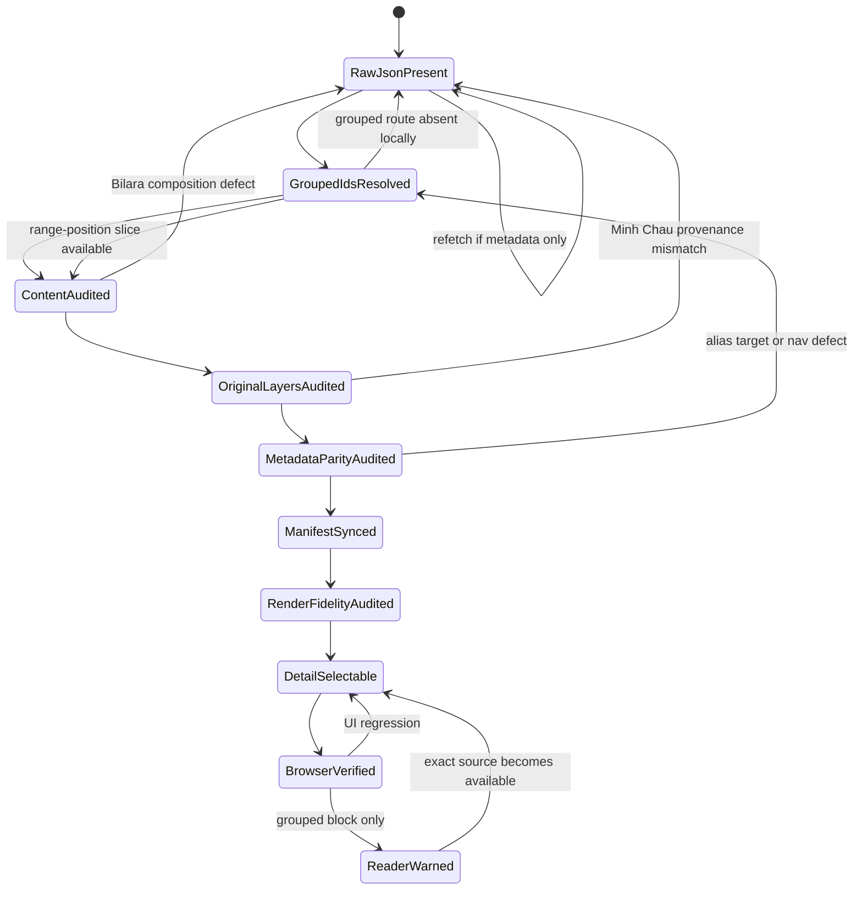

### Manual 2026 Loader

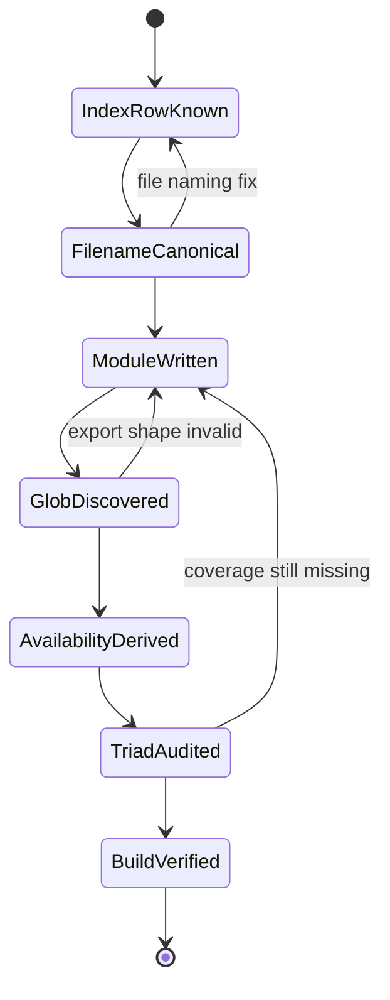

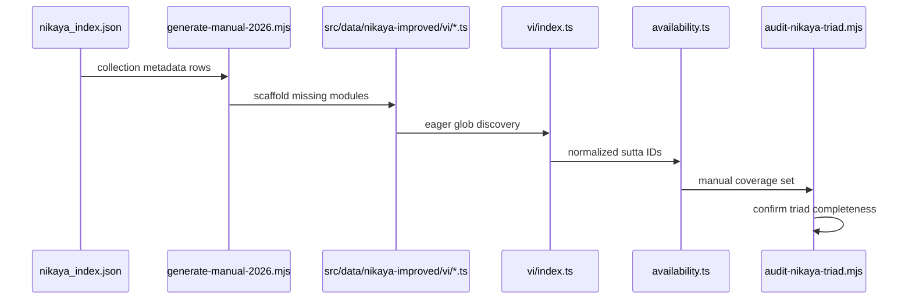

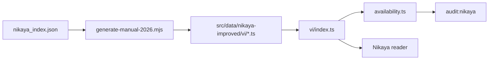

### Nikaya Source-Gap Flow

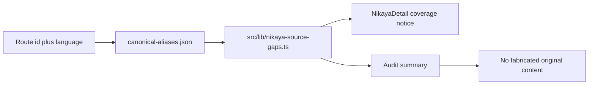

### Nikaya Sequence

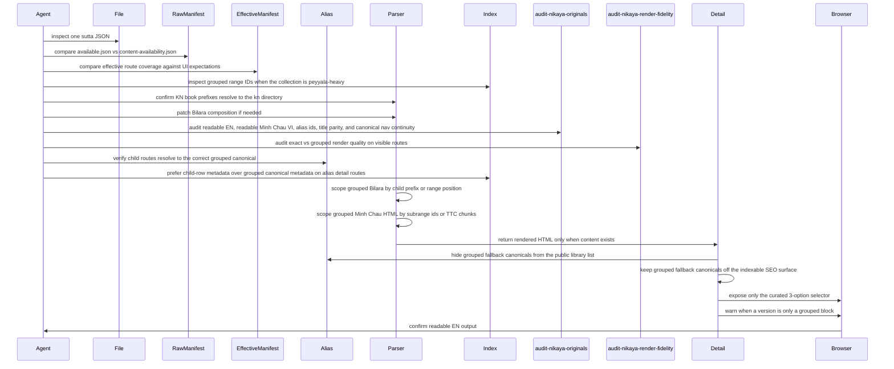

### Nikaya Data Flow

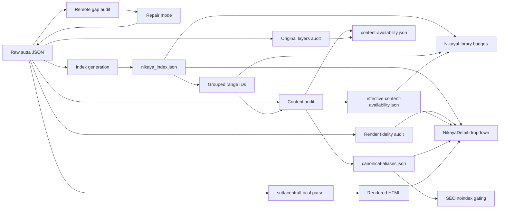

### State Machine

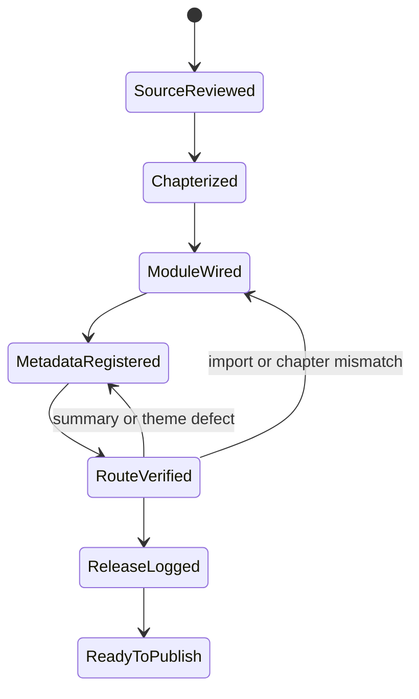

### Sequence

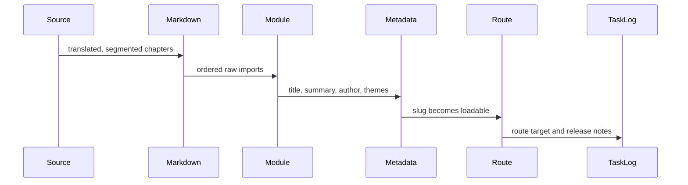

### Data Flow

## State Machine

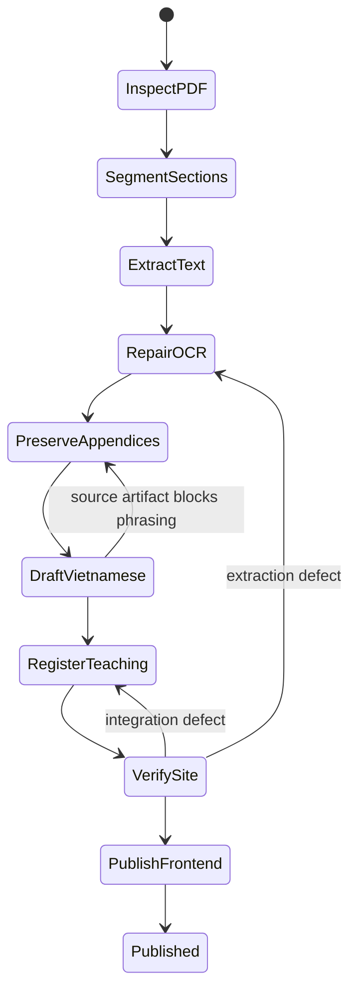

## Sequence

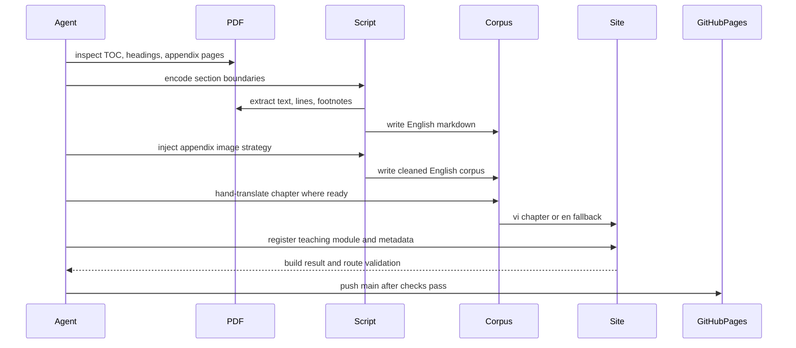

## Data Flow

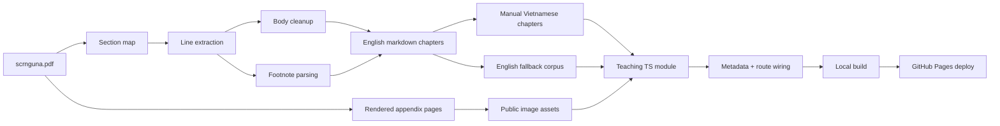

## Practical Rules

- Never trust automatic footnote placement on biography or front-matter pages. Only annotate numbers that actually exist as page footnotes.
- Run a dedicated front-matter QA pass. Cover pages, title pages, and library stamps often OCR into duplicated headings, isolated capitals, and other debris that must be rewritten into clean editorial prose before publication.
- Do not flatten tables or diagrams into broken prose. Preserve them as images with short textual summaries.
- Keep chapter files stable across reruns by using explicit numeric prefixes in filenames.
- Protect Pāli doctrinal vocabulary when translating. A bad translation of a key term is worse than leaving the term in transliteration.
- Treat the English markdown as the canonical extracted source.
- If the Vietnamese chapter is not yet elegant, doctrinally precise, and readable aloud, do not force publication. Let the module fall back to English.
- For this repo, a content-only release normally means frontend publish only.
- If a teaching grows large enough to create an oversized route chunk, prefer chapter-level `loadContent` loaders over eager raw markdown imports so the reader can hydrate progressively.
- Site verification now runs on Vite 8. Keep `manualChunks` function-based in `vite.config.ts`, and if chart routes fail under production bundling, confirm `react-is` is installed for `recharts`.
- As Nikaya manual coverage expands, the `nikaya-routes` bundle can cross Workbox's default 2 MiB precache limit. If build starts failing at the PWA step after a successful bundle, check `vite.config.ts` and raise `workbox.maximumFileSizeToCacheInBytes` deliberately instead of treating it like a content defect.
- Do not reintroduce a forced `vendor-markdown` chunk for the KaTeX reader stack. On this repo, Rolldown can emit a broken `katex_min_exports` symbol when `katex` and `rehype-katex` are grouped too aggressively.
- If math pages need lazy styling, keep `useKatexCSS` on the stylesheet-URL path. Avoid dynamic CSS module imports for `katex.min.css` unless you verify the emitted chunk graph in production.
- During route QA, inspect the page chrome as well as the manuscript body. Mis-scoped i18n keys such as `t('common.exportPdf')` can surface raw keys even when the content itself is clean.
- In `AN` peyyāla matrices, route titles must carry both the predicate and the paired qualities. Otherwise the UI can render many different child routes as if they were the same discourse.
- When closing `AN 2.230-279`, preserve the alternation between dark and bright pairs across all ten predicates. When moving to `AN 2.280-309`, drop that pair-language and re-anchor in Vinaya procedures plus their two stated purposes.
- When a peyyāla block repeats one stable rationale across many routes, as in `AN 2.280-309`, it is acceptable to centralize that rationale in a local helper so long as each route file still preserves a full route-level translation and a precise title.
- After the Vinaya peyyāla, reset the semantic map before authoring the next block. `AN 2.310-479` belongs to greed and allied defilements plus the two practices that undo them, not to monastic procedure.
- In the greed peyyāla, a small helper for the repeated `chỉ và quán` formula is acceptable, but the ladder verbs must remain explicit in each route title. The title is what preserves the doctrinal progression on the public surface.
- When advancing from `AN 2.310-339` to `AN 2.340+`, do not change the ladder wording unless the source forces it. The only variable should be the defilement under examination.
- The same rule holds for `AN 2.340-369`: keep the ten ladder verbs fixed and only swap the defilement. This is how the reader perceives the canonical pattern instead of a pile of disconnected aphorisms.
- The next tranche after `AN 2.369` should continue exactly with contempt, jealousy, and stinginess. Keep the grouped source order intact.
- `AN 2.370-399` is the next continuation of that same peyyāla ladder. Treat `paḷāsa`, `issā`, and `macchariya` as three distinct clusters, not as loose synonyms. In Vietnamese, `khinh thường`, `tật đố`, and `xan tham` keep the doctrinal edge sharper than broader modern paraphrases.
- `AN 2.400-429` extends the ladder into `māyā`, `sāṭheyya`, and `thambha`. Keep `man trá`, `phản trắc`, and `cứng đầu` separate. The block is still formulaic, but the moral texture shifts at each ten-sutta cluster, so titles need to do real doctrinal work.
- `AN 2.430-479` is the final closure of the whole `AN 2` defilement ladder. Keep `cuồng nhiệt`, `mạn`, `quá mạn`, `kiêu căng`, and `phóng dật` as five distinct clusters. After `an2.479`, the active sequential lane moves to `AN 3.1`.
- `AN 3.1-10` is no longer peyyāla compression. Each route carries its own argument about the fool and the wise, so the translation must preserve the sharper contrasts in conduct, thought, confession, and rational response. After this tranche, continue sequentially to `AN 3.11`.
- `AN 3.11-20` remains route-specific prose, not formula filler. Preserve the argumentative turn in each discourse: public influence, what must be remembered, who still hopes, principle as authority, the chariot-maker parable, the unfailing training, self-harm, revulsion toward heavenly rebirth as a goal, and the two shopkeeper similes. After this tranche, continue sequentially to `AN 3.21`.
- `AN 3.21-30` needs tonal range. The first half is classificatory and comparative, while the second half lands through images that must stay sharp when read aloud. Do not sand down the metaphors. `Vết thương làm mủ`, `kim cương`, `nói như phân`, `một mắt`, and `lộn ngược` should all remain vivid. After this tranche, continue sequentially to `AN 3.31`.
- `AN 3.31-40` must keep both warmth and gravity. `Cha mẹ như Phạm thiên` should sound reverent without sentimentality. `Diêm Vương` and the sứ giả cõi trời should remain morally severe. `Tăng Thượng` should read like a practice manual, not a slogan sheet. After this tranche, continue sequentially to `AN 3.41`.
- `AN 3.41-51` needs restraint in a different way. The short discourses on presence, faith, reasons, useful conversation, and ethical support should stay lean, bright, and fully route-complete. Do not inflate them with commentary. But when the block opens into `Đại đạo tặc` and `Hai Bà-la-môn`, keep the analogy and the dialogue fully unfolded. Those two lose their force if reduced to doctrinal bullets. After this tranche, continue sequentially to `AN 3.52`.
- `AN 3.52-63` has mixed texture. Keep `AN 3.52-55` dialogical and exact, since the doctrinal burden is in the stepwise contrast between defilement present and defilement ended. Then let `AN 3.56-61` stay sharp in tone: social breakdown, obstruction of giving, and critique of fatalism should not be blurred into generic moralism. `AN 3.62-63` need breadth, because they move from the fear of separation to the Buddha's own account of heavenly, divine, and noble repose. After this tranche, continue sequentially to `AN 3.64`.
- `AN 3.64-74` should sound like real disputation and instruction. `Sarabha` must keep the public embarrassment and lion's roar force. `Kesamutta` should preserve the testing-of-claims cadence, not a modern slogan version. `AN 3.71-74` must remain dialogical and technical where needed, especially around the path for abandoning greed, hate, and delusion, and the ethics-immersion-wisdom triad. After this tranche, continue sequentially to `AN 3.75`.
- `AN 3.75-85` changes texture several times, so do not smooth it into one register. `AN 3.75` should sound like direct pastoral instruction about what to establish in loved ones. `AN 3.76-77` are paired doctrinal discourses and must preserve the semantic shift between consciousness, intention, and the launching-point of renewed existence. `AN 3.78-80` require dialogical clarity, especially where the point is discrimination, reputation, or scale. `AN 3.81-85` return to the three trainings, but each route still needs its own shape, admonition, simile, case study, and defining verse. After this tranche, continue sequentially to `AN 3.86`.
- `AN 3.86-95` requires precise tonal control. The first three routes are not duplicates but three different mappings of the same training field, so preserve each attainment ladder distinctly. Then keep `AN 3.89-90` as a doctrinal hinge: one defines higher wisdom through the four noble truths, the next through arahant liberation. `AN 3.91` needs narrative remorse and institutional clarity. `AN 3.92-95` move through farm urgency, true seclusion, autumn brightness, and communal harmony, so let image and cadence do work without slipping into paraphrase or sermonizing. After this tranche, continue sequentially to `AN 3.96`.
- `AN 3.96-107` mixes public comparison, karmic scaling, meditation metallurgy, and awakening doctrine. Keep `AN 3.96-98` tightly parallel in structure. Let `AN 3.99-102` preserve their tactile similes, because the images are doing doctrinal work. In `AN 3.103-106`, never blur `vị ngọt`, `nguy hại`, and `xuất ly`; they are the load-bearing triad of the whole cluster. `AN 3.107` must remain austere and concise. After this tranche, continue sequentially to `AN 3.108`.
- `AN 3.108-118` needs range without drift. `AN 3.108-110` should stay short and severe. `AN 3.111-112` require careful distinction between unwholesome roots and the inner arising of bondage through proliferation. `AN 3.113-115` move through condemnation, gratitude, and measurelessness, so titles and opening lines must reset the reader each time. `AN 3.116` should preserve the contrast between worldling and noble disciple in the formless spheres. `AN 3.117-118` are doctrinal pairings on failure and accomplishment, but the second must keep the dice simile fully alive. After this tranche, continue sequentially to `AN 3.119`.
- `AN 3.119-129` alternates between doctrinal grids and social scenes. Keep `AN 3.119-122` compact and clean, but do not let the repeated triads blur together. Then allow the middle routes to reopen into narrative voice and situational texture. `AN 3.128` must retain the grossness of rot, decay, and flies. `AN 3.129` is a stark karmic diagnosis and should remain concise, exact, and unornamented. After this tranche, continue sequentially to `AN 3.130`.
- `AN 3.130-141` needs two registers. `AN 3.130` is intimate correction and must preserve the precision of Xá-lợi-phất's diagnosis, not turn into generic encouragement. `AN 3.131-139` are short but not interchangeable, because concealment, etched temper, warrior skill, assemblies, friendship, lawfulness, false doctrine, accomplishment, and growth each land on a different pressure point. `AN 3.140-141` are a deliberate pair, so keep the contrast between the wild colt and the excellent horse fully audible in the human analogies. After this tranche, continue sequentially to `AN 3.142`.
- `AN 3.142-151` tightens again. `AN 3.142` must land as the culmination of the horse imagery in arahant fulfillment, not merely as another checklist. `AN 3.143-145` are austere summit-discourses, so let them stay brief, high, and exact. `AN 3.146-151` form a compact ethical matrix around body, speech, and mind. Do not blur `bất thiện`, `đáng chê trách`, `phi giới`, `không thanh tịnh`, and `bị sứt mẻ`; each route shifts the moral lens, not just the wording. After this tranche, continue sequentially to `AN 3.152`.
- `AN 3.152-155` changes shape again. `AN 3.152` must preserve the contrast between indulgence, self-mortification, and the middle way without flattening the middle path into slogan form. `AN 3.153-154` are very short and should remain severe and exact. `AN 3.155` needs a chantable blessing cadence.
- `AN 3.156-162` looks blocked if you trust only the Minh Châu child files, but it is actually recoverable. Use the grouped English Bilara file `an3.156-162_en_sujato.json`, which contains exact child-prefixed segments for every route, then use the grouped Minh Châu shell as the Vietnamese cross-check for the repeated opening and the ordered middle-practice sets. Expand the repeated first two practices in full. Do not leave this tranche as ellipsis, and do not skip ahead to `AN 3.163` unless the batch is finished.
- `AN 3.163-182` is the next clean sequential tranche. The English grouped source is exact enough to restore all twenty route bodies, and the Minh Châu grouped shell keeps the pair order. Write it as ten mirrored hell and heaven pairs. Keep the triple structure audible in every route: tự mình làm, xúi người khác làm, và tán đồng. Do not blur the positive poles into generic goodness. Contentment, kindness, and right view must stay distinct.
- `AN 3.183-352` requires a different recovery method. The grouped English file is a compressed matrix, not a child-key bundle. Start by treating `an3.183-192` as the ten greed routes, each with one distinct operation verb and the same three samādhis. Only after finishing those ten should the lane move to the next object. The Vietnamese grouped shell is crucial here because it preserves the exact doctrinal verb ladder in good order.
- `AN 3.193-202` are the next matrix slice and should be authored as the ten hatred routes, not as a new freeform block. Reuse the same verb ladder from `an3.183-192`, only changing the defilement from greed to hatred. This is a serial doctrinal table, so consistency of the verb sequence matters more than ornamental prose variation.
- `AN 3.203-212` continue the same serial table with delusion. Keep the greed slice, then hatred slice, then delusion slice visibly parallel, or later agent passes will start to drift in titles and doctrinal force.
- `AN 3.213-222` should keep that same serial parallelism for anger. Resist the temptation to embellish the anger slice more than the earlier ones. The correctness signal here is consistency of the table, not novelty of expression.
- `AN 3.223-232` should preserve that same signal for acrimony. Once the agent chooses a Vietnamese rendering such as `hiềm hận`, keep it stable through the full ten-route slice instead of oscillating between near-synonyms.
- `AN 3.233-242` should apply the same discipline to disdain. Choose one clean rendering such as `khinh miệt` and hold it across the slice so the matrix remains visibly serial and auditable.
- `AN 3.243-252` should do the same for contempt. If the agent chooses `miệt thị`, keep that choice fixed through the slice and do not blur it back into the previous disdain tranche.
- `AN 3.253-262` should do the same for jealousy. If the agent chooses `ganh tỵ`, keep it fixed through the slice so the table still reads as one controlled doctrinal series instead of a cloud of near-synonyms.
- `AN 3.263-272` should do the same for stinginess. If the agent chooses `xan tham`, keep that label fixed across the full slice and let the unchanged verb ladder carry the serial logic.
- `AN 3.273-282` should do the same for deceitfulness. Prefer `giả dối`, since the grouped Minh Châu shell already points there, and keep it fixed so the transition into later `deviousness` routes can still be audited cleanly.
- `AN 3.283-292` should do the same for deviousness. Prefer `man trá`, keep it fixed across the slice, and let the distinction from the prior `giả dối` tranche remain visible without drifting into vague moral paraphrase.
- `AN 3.293-302` should do the same for obstinacy. Prefer `ngoan cố`, keep it fixed across the slice, and do not blur it into a milder psychological description, because the serial matrix depends on each object staying doctrinally distinct.
- `AN 3.303-312` should do the same for aggression. Prefer the grouped-shell phrase `bồng bột nông nổi`, keep it fixed across the slice, and let the route titles stay serial even if the phrase is longer than modern shorthand alternatives.
- `AN 3.313-322` should do the same for conceit. Prefer the strict label `mạn`, keep it fixed across the slice, and protect its distinction from the following `tăng thượng mạn` tranche.
- `AN 3.323-332` should do the same for arrogance. Prefer `tăng thượng mạn`, keep it fixed across the slice, and do not collapse it back into the previous `mạn` tranche, because the matrix is deliberately stepping through finer elevations of conceit.
- `AN 3.333-342` should do the same for vanity. Prefer `kiêu`, keep it fixed across the slice, and preserve its distance from both `mạn` and `tăng thượng mạn`, so the conceit ladder still reads as three distinct doctrinal cuts instead of one blurred pride cluster.

## Review Checklist

- Section ordering matches the source PDF.
- Page-scoped footnote labels are unique.
- No obvious split-word artifacts remain around footnote markers.
- Appendix pages render upright and at readable width.
- Metadata title, summary, difficulty, and themes match the manuscript.
- The teaching route resolves with chapter ordering intact.
- If the teaching is surfaced from `Pháp Bảo`, confirm the back link returns to `/phap-bao/giao-phap` and not the generic library root.
- If the route is public, confirm `dist/<route>/index.html` contains the expected canonical and JSON-LD after build.
- Site build passes after wiring.
- Pages deploy is triggered from `main`.
