# Long-Form Manuscript Ingestion

This skill documents the house method for turning a long PDF manuscript into site-ready teaching content without losing structure, citations, appendix material, or release discipline.

## When To Use It

Use this workflow when a source PDF is long, citation-heavy, or contains tables and diagrams that cannot survive plain OCR.

## Canonical Paths

- Source PDF: repo root or task-specific import path.
- Extraction script: `nhapluu-app/scripts/ingest_scrnguna.py`
- English corpus: `nhapluu-app/src/content/teachings/<slug>/en/`
- Vietnamese corpus: `nhapluu-app/src/content/teachings/<slug>/vi/`
- Appendix assets: `nhapluu-app/public/teachings/<slug>/`
- Site module: `nhapluu-app/src/data/teachings/<slug>/`

## Workflow

1. Inspect the PDF structure first.
2. Define section boundaries manually when the table of contents is reliable.
3. Extract body text and footnotes separately.
4. Repair OCR only where the errors are patterned and repeatable.
5. Replace broken appendix OCR with image-backed markdown when layout matters.
6. Draft or translate Vietnamese chapters carefully, chapter by chapter.
7. Keep English chapters as the canonical fallback for unfinished Vietnamese sections.
8. Build a small TypeScript bridge that imports chapter markdown into the site’s teaching model.
9. Verify build output and inspect the public page.
10. Publish the frontend by pushing `main` when the route is stable.

## Short-Form Translation Release

Use this lighter branch when the source is a retreat handout, a short essay, or a single translated talk that does not need OCR repair or appendix preservation.

1. Segment the piece into 3 to 6 markdown chapters if the source has natural shifts.
2. Store the text under `src/content/teachings/<slug>/vi/`.
3. Build a thin manifest bridge in `src/data/teachings/<slug>/index.ts`.
4. Register metadata in `src/data/teachings/metadata.ts`.
5. Add the slug to the lazy import map in `src/pages/TeachingDetail.tsx`.
6. Write a release log in the repo-root `tasks/` folder with source note and route target.
7. Run `npm run build` and `npm run lint` before calling the route ready.

## Route SEO Release Checks

Use this pass whenever a content release adds or changes a public route. The site now depends on a build-time SEO layer in addition to the client-side metadata hook.

1. Confirm the route has a unique title, summary, and canonical path.
2. Confirm the route family is represented in `scripts/build-seo-assets.mjs`.
3. Run `npm run build` so the generator writes static HTML, sitemap, and robots artifacts.
4. Inspect at least one generated file under `dist/<route>/index.html`.
5. Verify the route appears in the appropriate child sitemap referenced by `dist/sitemap.xml` if it is public.
6. Verify account or tool surfaces are excluded from the sitemap and carry `noindex,nofollow`.
7. Keep the default social image crawler-safe. Use the shared `og-default.png` unless the route genuinely warrants a bespoke asset.

## URL-Driven Library Branch Release

Use this pass when a library filter stops being local UI state and becomes a canonical branch route, as with `Nikaya` collection pages.

1. Move the filter source of truth from component state to pathname parsing.
2. Give each branch a stable collection URL and each detail page a canonical nested URL.
3. Preserve old detail URLs with a redirect route and static fallback HTML when direct deep links may already exist.
4. Pass `state.from` from listing to detail so back navigation lands on the right branch.
5. Update runtime metadata and build-time SEO enumeration together. Treat either half drifting out of sync as a release defect.
6. Verify branch pages are indexable only when they are canonical. Legacy redirect surfaces should be `noindex`.

### Branch State Machine

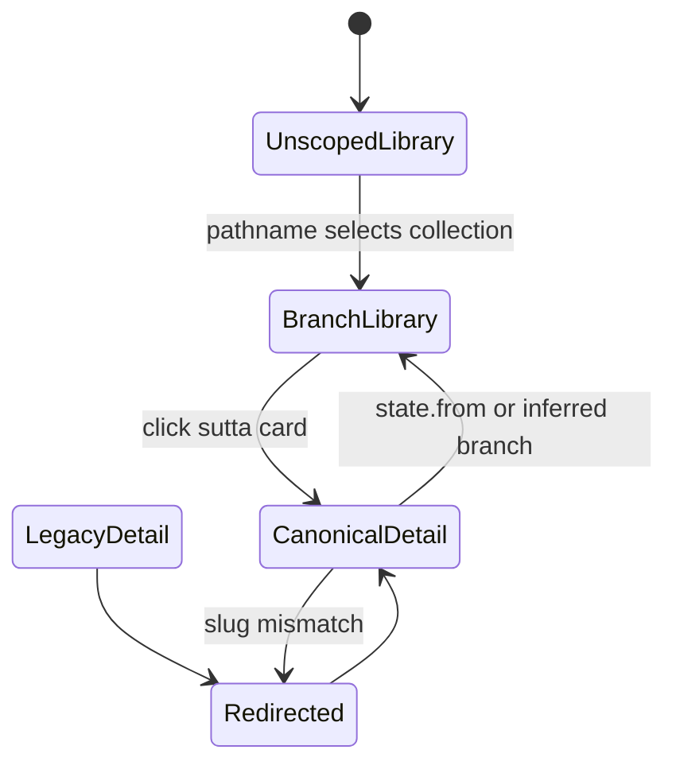

### Branch Sequence

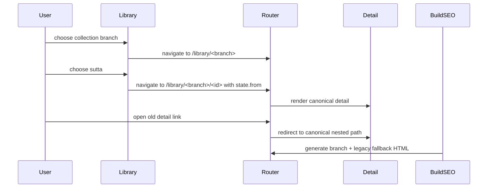

### Branch Data Flow

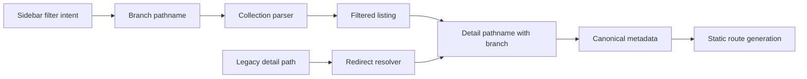

### SEO State Machine

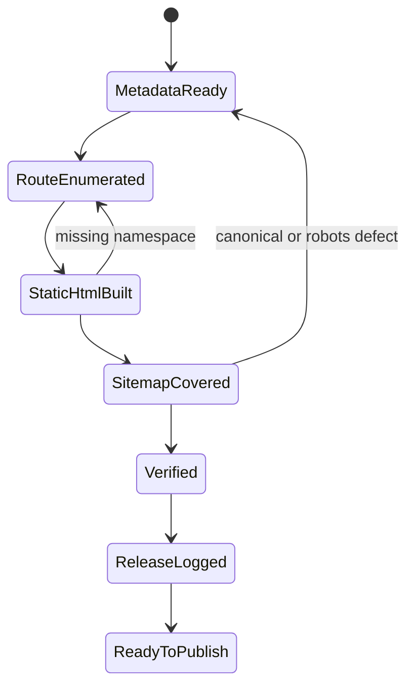

### SEO Sequence

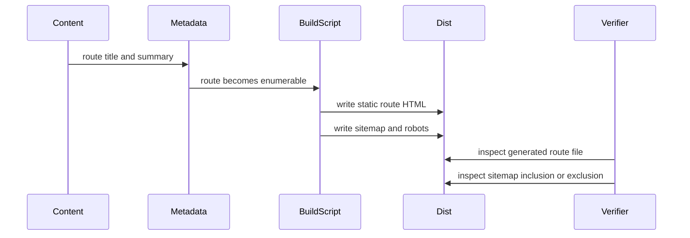

### SEO Data Flow

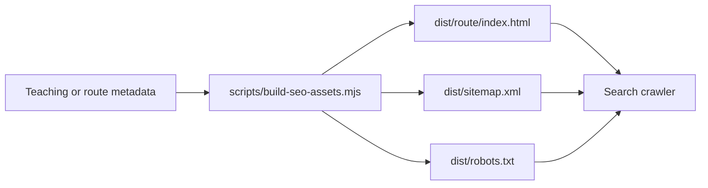

## Nikaya Sutta Data QA

Use this branch when Nikaya detail pages show placeholder prose, raw Bilara templates, or version options that claim to exist without readable content.

1. Inspect one affected local file under `public/data/suttacentral-json/<collection>/`.
2. Distinguish file presence from readable content. `available.json` is not enough for UI truth.
3. If the English payload comes from Bilara, inspect `html_text`, `translation_text`, `root_text`, and `keys_order`.
4. Compose Bilara `html_text` templates with `translation_text` before rendering. Do not render raw `{}` placeholders.
5. Publish content truth into `content-availability.json`.
6. Keep disabled any dropdown option that lacks local readable content.
7. Audit collection triad readiness with `npm run audit:nikaya -- <dn|mn|sn|an|kn>`.
8. If the collection is `SN` or another peyyala-heavy branch, inspect `nikaya_index.json` for grouped range IDs such as `sn12.72-81` and fetch those exact IDs too.
9. Treat Bilara `200 {"msg":"Not Found"}` responses as missing English, not success.
10. For `KN`, remember that collection inference must map `kp`, `dhp`, `ud`, `iti`, and `snp` into the `kn` folder.
11. Verify one collection route and one detail route in a browser after the patch.

### Nikaya State Machine

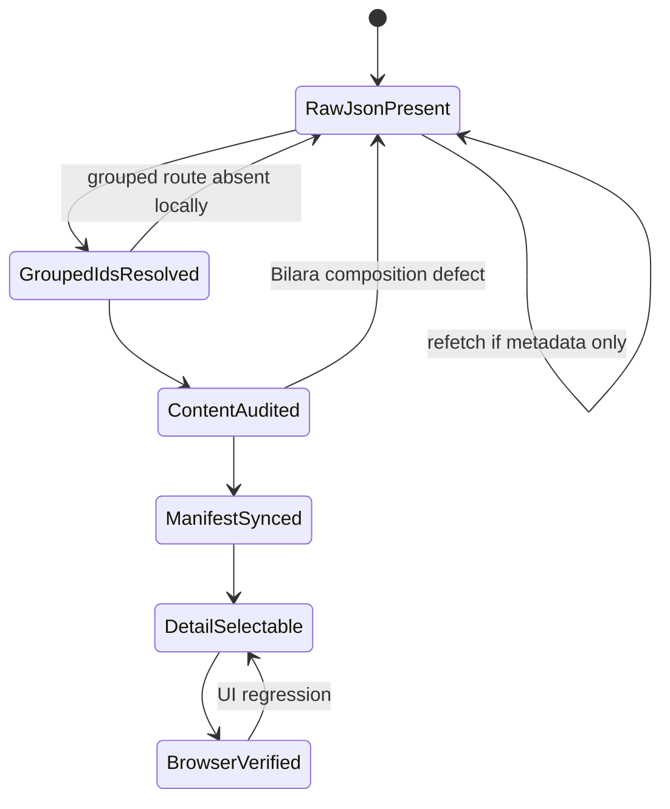

### Nikaya Sequence

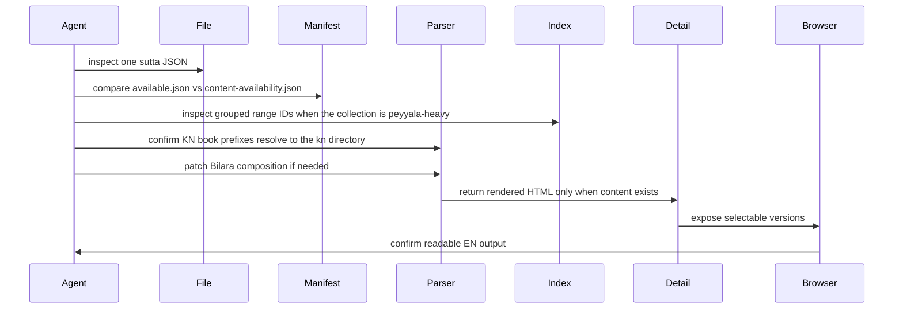

### Nikaya Data Flow

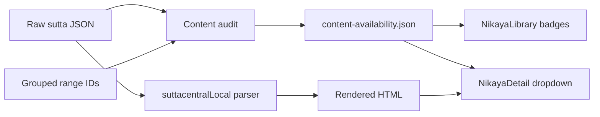

### State Machine

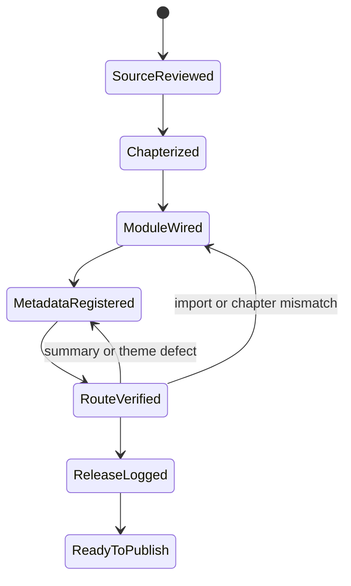

### Sequence

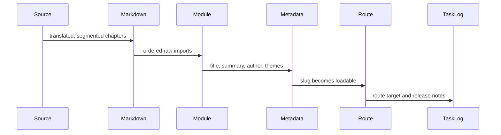

### Data Flow

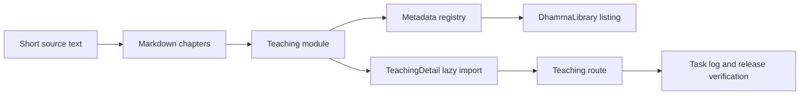

## State Machine

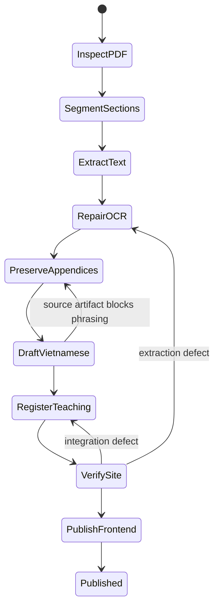

## Sequence

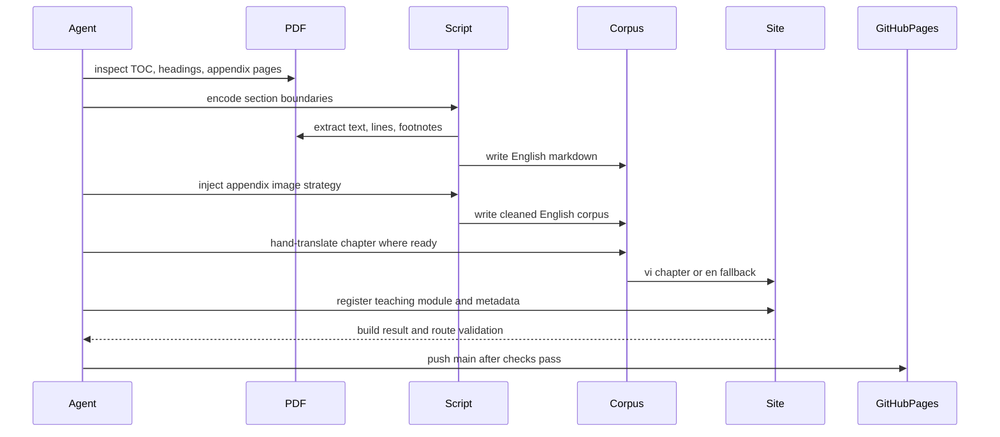

## Data Flow

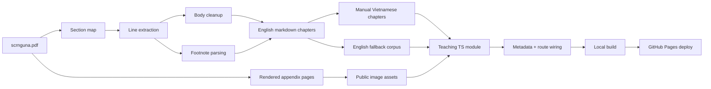

## Practical Rules

- Never trust automatic footnote placement on biography or front-matter pages. Only annotate numbers that actually exist as page footnotes.
- Run a dedicated front-matter QA pass. Cover pages, title pages, and library stamps often OCR into duplicated headings, isolated capitals, and other debris that must be rewritten into clean editorial prose before publication.
- Do not flatten tables or diagrams into broken prose. Preserve them as images with short textual summaries.
- Keep chapter files stable across reruns by using explicit numeric prefixes in filenames.
- Protect Pāli doctrinal vocabulary when translating. A bad translation of a key term is worse than leaving the term in transliteration.
- Treat the English markdown as the canonical extracted source.
- If the Vietnamese chapter is not yet elegant, doctrinally precise, and readable aloud, do not force publication. Let the module fall back to English.
- For this repo, a content-only release normally means frontend publish only.
- If a teaching grows large enough to create an oversized route chunk, prefer chapter-level `loadContent` loaders over eager raw markdown imports so the reader can hydrate progressively.
- Site verification now runs on Vite 8. Keep `manualChunks` function-based in `vite.config.ts`, and if chart routes fail under production bundling, confirm `react-is` is installed for `recharts`.
- Do not reintroduce a forced `vendor-markdown` chunk for the KaTeX reader stack. On this repo, Rolldown can emit a broken `katex_min_exports` symbol when `katex` and `rehype-katex` are grouped too aggressively.
- If math pages need lazy styling, keep `useKatexCSS` on the stylesheet-URL path. Avoid dynamic CSS module imports for `katex.min.css` unless you verify the emitted chunk graph in production.
- During route QA, inspect the page chrome as well as the manuscript body. Mis-scoped i18n keys such as `t('common.exportPdf')` can surface raw keys even when the content itself is clean.

## Review Checklist

- Section ordering matches the source PDF.
- Page-scoped footnote labels are unique.
- No obvious split-word artifacts remain around footnote markers.
- Appendix pages render upright and at readable width.
- Metadata title, summary, difficulty, and themes match the manuscript.
- The teaching route resolves with chapter ordering intact.
- If the teaching is surfaced from `Pháp Bảo`, confirm the back link returns to `/phap-bao/giao-phap` and not the generic library root.
- If the route is public, confirm `dist/<route>/index.html` contains the expected canonical and JSON-LD after build.
- Site build passes after wiring.
- Pages deploy is triggered from `main`.
