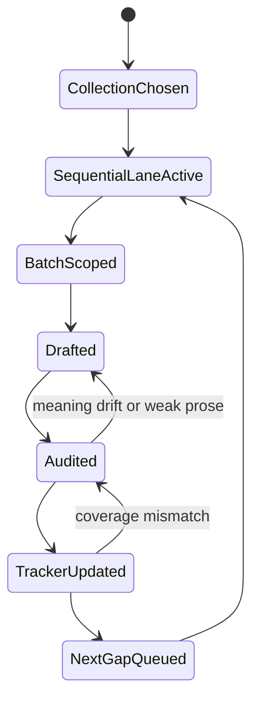

# Worklog Translate 2026

Tài liệu này là nguồn sự thật để theo dõi tiến độ lớp `Nhập Lưu 2026` trên toàn bộ 5 bộ kinh.

Nguyên tắc:
- đi tuần tự trong từng lane đang active
- không bỏ sót route ở giữa
- mỗi batch xong phải cập nhật file này ngay
- task log chi tiết vẫn nằm trong `tasks/`, còn file này giữ checkpoint tổng

## Translation Queue State

## Progress Snapshot

Last updated: 2026-03-21

| Collection | Total | Manual 2026 | Status | Current rule |
| --- | ---: | ---: | --- | --- |
| DN | 34 | 34 | Complete | revision only |
| MN | 152 | 152 | Complete | revision only |
| SN | 3024 | 19 | Partial | doctrinal spine first |
| AN | 8122 | 332 | Active | strict sequential continuation |
| KN | 694 | 12 | Partial | foothold clusters first |

## Active Lanes

### AN

- Lane type: sequential
- Completed through: `an1.332`
- Next missing route: `an1.333`
- Next grouped block: `an1.333-377`
- Latest completed batch log:
  - [tasks/2026-03-20-manual-2026-an-batch-12.md](/Volumes/SSD/nhapluu/nhapluu-app/tasks/2026-03-20-manual-2026-an-batch-12.md)
  - [tasks/2026-03-20-manual-2026-an-batch-13.md](/Volumes/SSD/nhapluu/nhapluu-app/tasks/2026-03-20-manual-2026-an-batch-13.md)
  - [tasks/2026-03-20-manual-2026-an-batch-14.md](/Volumes/SSD/nhapluu/nhapluu-app/tasks/2026-03-20-manual-2026-an-batch-14.md)
  - [tasks/2026-03-20-manual-2026-an-batch-15.md](/Volumes/SSD/nhapluu/nhapluu-app/tasks/2026-03-20-manual-2026-an-batch-15.md)
  - [tasks/2026-03-20-manual-2026-an-batch-16.md](/Volumes/SSD/nhapluu/nhapluu-app/tasks/2026-03-20-manual-2026-an-batch-16.md)
  - [tasks/2026-03-21-manual-2026-an-batch-17.md](/Volumes/SSD/nhapluu/nhapluu-app/tasks/2026-03-21-manual-2026-an-batch-17.md)
  - [tasks/2026-03-21-manual-2026-an-batch-18.md](/Volumes/SSD/nhapluu/nhapluu-app/tasks/2026-03-21-manual-2026-an-batch-18.md)
  - [tasks/2026-03-21-manual-2026-an-batch-19.md](/Volumes/SSD/nhapluu/nhapluu-app/tasks/2026-03-21-manual-2026-an-batch-19.md)
  - [tasks/2026-03-21-manual-2026-an-batch-20.md](/Volumes/SSD/nhapluu/nhapluu-app/tasks/2026-03-21-manual-2026-an-batch-20.md)
  - [tasks/2026-03-21-manual-2026-an-batch-21.md](/Volumes/SSD/nhapluu/nhapluu-app/tasks/2026-03-21-manual-2026-an-batch-21.md)
  - [tasks/2026-03-21-manual-2026-an-batch-22.md](/Volumes/SSD/nhapluu/nhapluu-app/tasks/2026-03-21-manual-2026-an-batch-22.md)
  - [tasks/2026-03-21-manual-2026-an-batch-23.md](/Volumes/SSD/nhapluu/nhapluu-app/tasks/2026-03-21-manual-2026-an-batch-23.md)
  - [tasks/2026-03-21-manual-2026-an-batch-24.md](/Volumes/SSD/nhapluu/nhapluu-app/tasks/2026-03-21-manual-2026-an-batch-24.md)
  - [tasks/2026-03-21-manual-2026-an-batch-25.md](/Volumes/SSD/nhapluu/nhapluu-app/tasks/2026-03-21-manual-2026-an-batch-25.md)

### SN

- Lane type: doctrinal spine before full sweep
- Completed anchors:
  - `sn12.1`, `sn12.2`, `sn12.12`, `sn12.15`
  - `sn22.22`, `sn22.59`, `sn22.95`
  - `sn35.23`, `sn35.28`, `sn35.63`
  - `sn45.8`, `sn46.51`, `sn47.13`, `sn47.42`
  - `sn48.10`, `sn55.1`, `sn56.1`, `sn56.11`, `sn56.13`
- Next missing route if switching to strict sequence: `sn1.1`

### KN

- Lane type: foothold clusters
- Completed clusters:
  - `kp1-kp9`
  - `snp1.8`
  - `snp2.4`
  - `snp3.7`
- Next missing route if switching to strict sequence: `dhp1`

## Batch History

- 2026-03-20
  - Completed `AN 1.170-187`
  - Coverage moved `169 -> 187`
- 2026-03-20
  - Completed `AN 1.188-197`
  - Coverage moved `187 -> 197`
- 2026-03-20
  - Completed `AN 1.198-208`
  - Coverage moved `197 -> 208`
- 2026-03-20
  - Completed `AN 1.209-218`
  - Coverage moved `208 -> 218`
- 2026-03-20
  - Completed `AN 1.219-234`
  - Coverage moved `218 -> 234`
- 2026-03-21
  - Completed `AN 1.235-247`
  - Coverage moved `234 -> 247`
- 2026-03-21
  - Completed `AN 1.248-257`
  - Coverage moved `247 -> 257`
- 2026-03-21
  - Completed `AN 1.258-267`
  - Coverage moved `257 -> 267`
- 2026-03-21
  - Completed `AN 1.268-277`
  - Coverage moved `267 -> 277`
- 2026-03-21
  - Completed `AN 1.278-286`
  - Coverage moved `277 -> 286`
- 2026-03-21
  - Completed `AN 1.287-295`
  - Coverage moved `286 -> 295`
- 2026-03-21
  - Completed `AN 1.296-305`
  - Coverage moved `295 -> 305`
- 2026-03-21
  - Completed `AN 1.306-315`
  - Coverage moved `305 -> 315`
- 2026-03-21
  - Completed `AN 1.316-332`
  - Coverage moved `315 -> 332`

## Notes

- `DN` and `MN` are already coverage-complete. Work there is editorial revision, not backfill.
- `AN` is the only collection currently under strict sequential continuation.
- If priorities change, update the `Active Lanes` section before starting a new batch.
