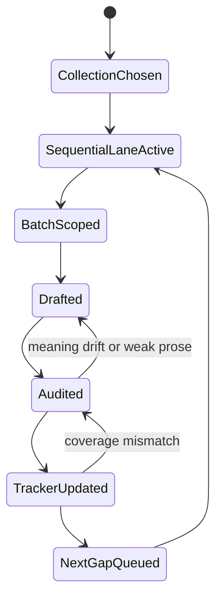

# Worklog Translate 2026

Tài liệu này là nguồn sự thật để theo dõi tiến độ lớp `Nhập Lưu 2026` trên toàn bộ 5 bộ kinh.

Nguyên tắc:
- đi tuần tự trong từng lane đang active
- không bỏ sót route ở giữa
- mỗi batch xong phải cập nhật file này ngay
- task log chi tiết vẫn nằm trong `tasks/`, còn file này giữ checkpoint tổng

## Translation Queue State

## Progress Snapshot

Last updated: 2026-03-21

| Collection | Total | Manual 2026 | Status | Current rule |
| --- | ---: | ---: | --- | --- |
| DN | 34 | 34 | Complete | revision only |
| MN | 152 | 152 | Complete | revision only |
| SN | 3024 | 19 | Partial | doctrinal spine first |
| AN | 8122 | 1191 | Active | strict sequential continuation |
| KN | 694 | 12 | Partial | foothold clusters first |

## Active Lanes

### AN

- Lane type: sequential
- Completed through: `an3.85`
- Next missing route: `an3.86`
- Next grouped block: `an3.86-95`
- Latest completed batch log:
  - [tasks/2026-03-20-manual-2026-an-batch-12.md](/Volumes/SSD/nhapluu/nhapluu-app/tasks/2026-03-20-manual-2026-an-batch-12.md)
  - [tasks/2026-03-20-manual-2026-an-batch-13.md](/Volumes/SSD/nhapluu/nhapluu-app/tasks/2026-03-20-manual-2026-an-batch-13.md)
  - [tasks/2026-03-20-manual-2026-an-batch-14.md](/Volumes/SSD/nhapluu/nhapluu-app/tasks/2026-03-20-manual-2026-an-batch-14.md)
  - [tasks/2026-03-20-manual-2026-an-batch-15.md](/Volumes/SSD/nhapluu/nhapluu-app/tasks/2026-03-20-manual-2026-an-batch-15.md)
  - [tasks/2026-03-20-manual-2026-an-batch-16.md](/Volumes/SSD/nhapluu/nhapluu-app/tasks/2026-03-20-manual-2026-an-batch-16.md)
  - [tasks/2026-03-21-manual-2026-an-batch-17.md](/Volumes/SSD/nhapluu/nhapluu-app/tasks/2026-03-21-manual-2026-an-batch-17.md)
  - [tasks/2026-03-21-manual-2026-an-batch-18.md](/Volumes/SSD/nhapluu/nhapluu-app/tasks/2026-03-21-manual-2026-an-batch-18.md)
  - [tasks/2026-03-21-manual-2026-an-batch-19.md](/Volumes/SSD/nhapluu/nhapluu-app/tasks/2026-03-21-manual-2026-an-batch-19.md)
  - [tasks/2026-03-21-manual-2026-an-batch-20.md](/Volumes/SSD/nhapluu/nhapluu-app/tasks/2026-03-21-manual-2026-an-batch-20.md)
  - [tasks/2026-03-21-manual-2026-an-batch-21.md](/Volumes/SSD/nhapluu/nhapluu-app/tasks/2026-03-21-manual-2026-an-batch-21.md)
  - [tasks/2026-03-21-manual-2026-an-batch-22.md](/Volumes/SSD/nhapluu/nhapluu-app/tasks/2026-03-21-manual-2026-an-batch-22.md)
  - [tasks/2026-03-21-manual-2026-an-batch-23.md](/Volumes/SSD/nhapluu/nhapluu-app/tasks/2026-03-21-manual-2026-an-batch-23.md)
  - [tasks/2026-03-21-manual-2026-an-batch-24.md](/Volumes/SSD/nhapluu/nhapluu-app/tasks/2026-03-21-manual-2026-an-batch-24.md)
  - [tasks/2026-03-21-manual-2026-an-batch-25.md](/Volumes/SSD/nhapluu/nhapluu-app/tasks/2026-03-21-manual-2026-an-batch-25.md)
  - [tasks/2026-03-21-manual-2026-an-batch-26.md](/Volumes/SSD/nhapluu/nhapluu-app/tasks/2026-03-21-manual-2026-an-batch-26.md)
  - [tasks/2026-03-21-manual-2026-an-batch-27.md](/Volumes/SSD/nhapluu/nhapluu-app/tasks/2026-03-21-manual-2026-an-batch-27.md)
  - [tasks/2026-03-21-manual-2026-an-batch-28.md](/Volumes/SSD/nhapluu/nhapluu-app/tasks/2026-03-21-manual-2026-an-batch-28.md)
  - [tasks/2026-03-21-manual-2026-an-batch-29.md](/Volumes/SSD/nhapluu/nhapluu-app/tasks/2026-03-21-manual-2026-an-batch-29.md)
  - [tasks/2026-03-21-manual-2026-an-batch-30.md](/Volumes/SSD/nhapluu/nhapluu-app/tasks/2026-03-21-manual-2026-an-batch-30.md)
  - [tasks/2026-03-21-manual-2026-an-batch-31.md](/Volumes/SSD/nhapluu/nhapluu-app/tasks/2026-03-21-manual-2026-an-batch-31.md)
  - [tasks/2026-03-21-manual-2026-an-batch-32.md](/Volumes/SSD/nhapluu/nhapluu-app/tasks/2026-03-21-manual-2026-an-batch-32.md)
  - [tasks/2026-03-21-manual-2026-an-batch-33.md](/Volumes/SSD/nhapluu/nhapluu-app/tasks/2026-03-21-manual-2026-an-batch-33.md)
  - [tasks/2026-03-21-manual-2026-an-batch-34.md](/Volumes/SSD/nhapluu/nhapluu-app/tasks/2026-03-21-manual-2026-an-batch-34.md)
  - [tasks/2026-03-21-manual-2026-an-batch-35.md](/Volumes/SSD/nhapluu/nhapluu-app/tasks/2026-03-21-manual-2026-an-batch-35.md)
  - [tasks/2026-03-21-manual-2026-an-batch-36.md](/Volumes/SSD/nhapluu/nhapluu-app/tasks/2026-03-21-manual-2026-an-batch-36.md)
  - [tasks/2026-03-21-manual-2026-an-batch-37.md](/Volumes/SSD/nhapluu/nhapluu-app/tasks/2026-03-21-manual-2026-an-batch-37.md)
  - [tasks/2026-03-21-manual-2026-an-batch-38.md](/Volumes/SSD/nhapluu/nhapluu-app/tasks/2026-03-21-manual-2026-an-batch-38.md)
  - [tasks/2026-03-21-manual-2026-an-batch-39.md](/Volumes/SSD/nhapluu/nhapluu-app/tasks/2026-03-21-manual-2026-an-batch-39.md)
  - [tasks/2026-03-21-manual-2026-an-batch-40.md](/Volumes/SSD/nhapluu/nhapluu-app/tasks/2026-03-21-manual-2026-an-batch-40.md)
  - [tasks/2026-03-21-manual-2026-an-batch-41.md](/Volumes/SSD/nhapluu/nhapluu-app/tasks/2026-03-21-manual-2026-an-batch-41.md)
  - [tasks/2026-03-21-manual-2026-an-batch-42.md](/Volumes/SSD/nhapluu/nhapluu-app/tasks/2026-03-21-manual-2026-an-batch-42.md)
  - [tasks/2026-03-21-manual-2026-an-batch-43.md](/Volumes/SSD/nhapluu/nhapluu-app/tasks/2026-03-21-manual-2026-an-batch-43.md)
  - [tasks/2026-03-21-manual-2026-an-batch-44.md](/Volumes/SSD/nhapluu/nhapluu-app/tasks/2026-03-21-manual-2026-an-batch-44.md)
  - [tasks/2026-03-21-manual-2026-an-batch-45.md](/Volumes/SSD/nhapluu/nhapluu-app/tasks/2026-03-21-manual-2026-an-batch-45.md)
  - [tasks/2026-03-21-manual-2026-an-batch-46.md](/Volumes/SSD/nhapluu/nhapluu-app/tasks/2026-03-21-manual-2026-an-batch-46.md)
  - [tasks/2026-03-21-manual-2026-an-batch-47.md](/Volumes/SSD/nhapluu/nhapluu-app/tasks/2026-03-21-manual-2026-an-batch-47.md)
  - [tasks/2026-03-21-manual-2026-an-batch-48.md](/Volumes/SSD/nhapluu/nhapluu-app/tasks/2026-03-21-manual-2026-an-batch-48.md)
  - [tasks/2026-03-21-manual-2026-an-batch-49.md](/Volumes/SSD/nhapluu/nhapluu-app/tasks/2026-03-21-manual-2026-an-batch-49.md)
  - [tasks/2026-03-21-manual-2026-an-batch-50.md](/Volumes/SSD/nhapluu/nhapluu-app/tasks/2026-03-21-manual-2026-an-batch-50.md)
  - [tasks/2026-03-21-manual-2026-an-batch-51.md](/Volumes/SSD/nhapluu/nhapluu-app/tasks/2026-03-21-manual-2026-an-batch-51.md)
  - [tasks/2026-03-21-manual-2026-an-batch-52.md](/Volumes/SSD/nhapluu/nhapluu-app/tasks/2026-03-21-manual-2026-an-batch-52.md)
  - [tasks/2026-03-21-manual-2026-an-batch-53.md](/Volumes/SSD/nhapluu/nhapluu-app/tasks/2026-03-21-manual-2026-an-batch-53.md)
  - [tasks/2026-03-21-manual-2026-an-batch-54.md](/Volumes/SSD/nhapluu/nhapluu-app/tasks/2026-03-21-manual-2026-an-batch-54.md)
  - [tasks/2026-03-21-manual-2026-an-batch-55.md](/Volumes/SSD/nhapluu/nhapluu-app/tasks/2026-03-21-manual-2026-an-batch-55.md)
  - [tasks/2026-03-21-manual-2026-an-batch-56.md](/Volumes/SSD/nhapluu/nhapluu-app/tasks/2026-03-21-manual-2026-an-batch-56.md)
  - [tasks/2026-03-21-manual-2026-an-batch-57.md](/Volumes/SSD/nhapluu/nhapluu-app/tasks/2026-03-21-manual-2026-an-batch-57.md)
  - [tasks/2026-03-21-manual-2026-an-batch-58.md](/Volumes/SSD/nhapluu/nhapluu-app/tasks/2026-03-21-manual-2026-an-batch-58.md)
  - [tasks/2026-03-21-manual-2026-an-batch-59.md](/Volumes/SSD/nhapluu/nhapluu-app/tasks/2026-03-21-manual-2026-an-batch-59.md)
  - [tasks/2026-03-21-manual-2026-an-batch-60.md](/Volumes/SSD/nhapluu/nhapluu-app/tasks/2026-03-21-manual-2026-an-batch-60.md)
  - [tasks/2026-03-21-manual-2026-an-batch-61.md](/Volumes/SSD/nhapluu/nhapluu-app/tasks/2026-03-21-manual-2026-an-batch-61.md)
  - [tasks/2026-03-21-manual-2026-an-batch-62.md](/Volumes/SSD/nhapluu/nhapluu-app/tasks/2026-03-21-manual-2026-an-batch-62.md)
  - [tasks/2026-03-21-manual-2026-an-batch-63.md](/Volumes/SSD/nhapluu/nhapluu-app/tasks/2026-03-21-manual-2026-an-batch-63.md)
  - [tasks/2026-03-21-manual-2026-an-batch-64.md](/Volumes/SSD/nhapluu/nhapluu-app/tasks/2026-03-21-manual-2026-an-batch-64.md)
  - [tasks/2026-03-21-manual-2026-an-batch-65.md](/Volumes/SSD/nhapluu/nhapluu-app/tasks/2026-03-21-manual-2026-an-batch-65.md)
  - [tasks/2026-03-21-manual-2026-an-batch-66.md](/Volumes/SSD/nhapluu/nhapluu-app/tasks/2026-03-21-manual-2026-an-batch-66.md)
  - [tasks/2026-03-21-manual-2026-an-batch-67.md](/Volumes/SSD/nhapluu/nhapluu-app/tasks/2026-03-21-manual-2026-an-batch-67.md)
  - [tasks/2026-03-21-manual-2026-an-batch-68.md](/Volumes/SSD/nhapluu/nhapluu-app/tasks/2026-03-21-manual-2026-an-batch-68.md)
  - [tasks/2026-03-21-manual-2026-an-batch-69.md](/Volumes/SSD/nhapluu/nhapluu-app/tasks/2026-03-21-manual-2026-an-batch-69.md)
  - [tasks/2026-03-21-manual-2026-an-batch-70.md](/Volumes/SSD/nhapluu/nhapluu-app/tasks/2026-03-21-manual-2026-an-batch-70.md)
  - [tasks/2026-03-21-manual-2026-an-batch-71.md](/Volumes/SSD/nhapluu/nhapluu-app/tasks/2026-03-21-manual-2026-an-batch-71.md)
  - [tasks/2026-03-21-manual-2026-an-batch-72.md](/Volumes/SSD/nhapluu/nhapluu-app/tasks/2026-03-21-manual-2026-an-batch-72.md)
  - [tasks/2026-03-21-manual-2026-an-batch-73.md](/Volumes/SSD/nhapluu/nhapluu-app/tasks/2026-03-21-manual-2026-an-batch-73.md)
  - [tasks/2026-03-21-manual-2026-an-batch-74.md](/Volumes/SSD/nhapluu/nhapluu-app/tasks/2026-03-21-manual-2026-an-batch-74.md)
  - [tasks/2026-03-21-manual-2026-an-batch-75.md](/Volumes/SSD/nhapluu/nhapluu-app/tasks/2026-03-21-manual-2026-an-batch-75.md)
  - [tasks/2026-03-21-manual-2026-an-batch-76.md](/Volumes/SSD/nhapluu/nhapluu-app/tasks/2026-03-21-manual-2026-an-batch-76.md)
  - [tasks/2026-03-21-manual-2026-an-batch-77.md](/Volumes/SSD/nhapluu/nhapluu-app/tasks/2026-03-21-manual-2026-an-batch-77.md)
  - [tasks/2026-03-21-manual-2026-an-batch-78.md](/Volumes/SSD/nhapluu/nhapluu-app/tasks/2026-03-21-manual-2026-an-batch-78.md)
  - [tasks/2026-03-21-manual-2026-an-batch-79.md](/Volumes/SSD/nhapluu/nhapluu-app/tasks/2026-03-21-manual-2026-an-batch-79.md)
  - [tasks/2026-03-21-manual-2026-an-batch-80.md](/Volumes/SSD/nhapluu/nhapluu-app/tasks/2026-03-21-manual-2026-an-batch-80.md)

### SN

- Lane type: doctrinal spine before full sweep
- Completed anchors:
  - `sn12.1`, `sn12.2`, `sn12.12`, `sn12.15`
  - `sn22.22`, `sn22.59`, `sn22.95`
  - `sn35.23`, `sn35.28`, `sn35.63`
  - `sn45.8`, `sn46.51`, `sn47.13`, `sn47.42`
  - `sn48.10`, `sn55.1`, `sn56.1`, `sn56.11`, `sn56.13`
- Next missing route if switching to strict sequence: `sn1.1`

### KN

- Lane type: foothold clusters
- Completed clusters:
  - `kp1-kp9`
  - `snp1.8`
  - `snp2.4`
  - `snp3.7`
- Next missing route if switching to strict sequence: `dhp1`

## Batch History

- 2026-03-20
  - Completed `AN 1.170-187`
  - Coverage moved `169 -> 187`
- 2026-03-20
  - Completed `AN 1.188-197`
  - Coverage moved `187 -> 197`
- 2026-03-20
  - Completed `AN 1.198-208`
  - Coverage moved `197 -> 208`
- 2026-03-20
  - Completed `AN 1.209-218`
  - Coverage moved `208 -> 218`
- 2026-03-20
  - Completed `AN 1.219-234`
  - Coverage moved `218 -> 234`
- 2026-03-21
  - Completed `AN 1.235-247`
  - Coverage moved `234 -> 247`
- 2026-03-21
  - Completed `AN 1.248-257`
  - Coverage moved `247 -> 257`
- 2026-03-21
  - Completed `AN 1.258-267`
  - Coverage moved `257 -> 267`
- 2026-03-21
  - Completed `AN 1.268-277`
  - Coverage moved `267 -> 277`
- 2026-03-21
  - Completed `AN 1.278-286`
  - Coverage moved `277 -> 286`
- 2026-03-21
  - Completed `AN 1.287-295`
  - Coverage moved `286 -> 295`
- 2026-03-21
  - Completed `AN 1.296-305`
  - Coverage moved `295 -> 305`
- 2026-03-21
  - Completed `AN 1.306-315`
  - Coverage moved `305 -> 315`
- 2026-03-21
  - Completed `AN 1.316-332`
  - Coverage moved `315 -> 332`
- 2026-03-21
  - Completed `AN 1.333-347`
  - Coverage moved `332 -> 347`
- 2026-03-21
  - Completed `AN 1.348-377`
  - Coverage moved `347 -> 377`
- 2026-03-21
  - Completed `AN 1.378-393`
  - Coverage moved `377 -> 393`
- 2026-03-21
  - Completed `AN 1.394-401`
  - Coverage moved `393 -> 401`
- 2026-03-21
  - Completed `AN 1.402-423`
  - Coverage moved `401 -> 423`
- 2026-03-21
  - Completed `AN 1.424-438`
  - Coverage moved `423 -> 438`
- 2026-03-21
  - Completed `AN 1.439-454`
  - Coverage moved `438 -> 454`
- 2026-03-21
  - Completed `AN 1.455-464`
  - Coverage moved `454 -> 464`
- 2026-03-21
  - Completed `AN 1.465-474`
  - Coverage moved `464 -> 474`
- 2026-03-21
  - Completed `AN 1.475-484`
  - Coverage moved `474 -> 484`
- 2026-03-21
  - Completed `AN 1.485-494`
  - Coverage moved `484 -> 494`
- 2026-03-21
  - Completed `AN 1.495-504`
  - Coverage moved `494 -> 504`
- 2026-03-21
  - Completed `AN 1.505-514`
  - Coverage moved `504 -> 514`
- 2026-03-21
  - Completed `AN 1.515-524`
  - Coverage moved `514 -> 524`
- 2026-03-21
  - Completed `AN 1.525-534`
  - Coverage moved `524 -> 534`
- 2026-03-21
  - Completed `AN 1.535-544`
  - Coverage moved `534 -> 544`
- 2026-03-21
  - Completed `AN 1.545-554`
  - Coverage moved `544 -> 554`
- 2026-03-21
  - Completed `AN 1.555-564`
  - Coverage moved `554 -> 564`
- 2026-03-21
  - Completed `AN 1.565-574`
  - Coverage moved `564 -> 574`
- 2026-03-21
  - Completed `AN 1.575-595`
  - Coverage moved `574 -> 595`
- 2026-03-21
  - Completed `AN 1.596-615`
  - Coverage moved `595 -> 615`
- 2026-03-21
  - Completed `AN 1.616-627`
  - Coverage moved `615 -> 627`
- 2026-03-21
  - Completed `AN 2.1-10`
  - Coverage moved `627 -> 637`
- 2026-03-21
  - Completed `AN 2.11-20`
  - Coverage moved `637 -> 647`
- 2026-03-21
  - Completed `AN 2.21-31`
  - Coverage moved `647 -> 658`
- 2026-03-21
  - Completed `AN 2.32-41`
  - Coverage moved `658 -> 668`
- 2026-03-21
  - Completed `AN 2.42-51`
  - Coverage moved `668 -> 678`
- 2026-03-21
  - Completed `AN 2.52-63`
  - Coverage moved `678 -> 690`
- 2026-03-21
  - Completed `AN 2.64-76`
  - Coverage moved `690 -> 703`
- 2026-03-21
  - Completed `AN 2.77-86`
  - Coverage moved `703 -> 713`
- 2026-03-21
  - Completed `AN 2.87-97`
  - Coverage moved `713 -> 724`
- 2026-03-21
  - Completed `AN 2.98-108`
  - Coverage moved `724 -> 735`
- 2026-03-21
  - Completed `AN 2.109-117`
  - Coverage moved `735 -> 744`
- 2026-03-21
  - Completed `AN 2.118-129`
  - Coverage moved `744 -> 756`
- 2026-03-21
  - Completed `AN 2.130-140`
  - Coverage moved `756 -> 767`
- 2026-03-21
  - Completed `AN 2.141-150`
  - Coverage moved `767 -> 777`
- 2026-03-21
  - Completed `AN 2.151-162`
  - Coverage moved `777 -> 789`
- 2026-03-21
  - Completed `AN 2.163-179`
  - Coverage moved `789 -> 806`
- 2026-03-21
  - Completed `AN 2.180-199`
  - Coverage moved `806 -> 826`
- 2026-03-21
  - Completed `AN 2.200-229`
  - Coverage moved `826 -> 856`
- 2026-03-21
  - Completed `AN 2.230-279`
  - Coverage moved `856 -> 906`
- 2026-03-21
  - Completed `AN 2.280-309`
  - Coverage moved `906 -> 936`
- 2026-03-21
  - Completed `AN 2.310-339`
  - Coverage moved `936 -> 966`
- 2026-03-21
  - Completed `AN 2.340-369`
  - Coverage moved `966 -> 996`
- 2026-03-21
  - Completed `AN 2.370-399`
  - Coverage moved `996 -> 1026`
- 2026-03-21
  - Completed `AN 2.400-429`
  - Coverage moved `1026 -> 1056`
- 2026-03-21
  - Completed `AN 2.430-479`
  - Coverage moved `1056 -> 1106`
- 2026-03-21
  - Completed `AN 3.1-10`
  - Coverage moved `1106 -> 1116`
- 2026-03-21
  - Completed `AN 3.11-20`
  - Coverage moved `1116 -> 1126`
- 2026-03-21
  - Completed `AN 3.21-30`
  - Coverage moved `1126 -> 1136`
- 2026-03-21
  - Completed `AN 3.31-40`
  - Coverage moved `1136 -> 1146`
- 2026-03-21
  - Completed `AN 3.41-51`
  - Coverage moved `1146 -> 1157`
- 2026-03-21
  - Completed `AN 3.52-63`
  - Coverage moved `1157 -> 1169`
- 2026-03-21
  - Completed `AN 3.64-74`
  - Coverage moved `1169 -> 1180`
- 2026-03-21
  - Completed `AN 3.75-85`
  - Coverage moved `1180 -> 1191`

## Notes

- `DN` and `MN` are already coverage-complete. Work there is editorial revision, not backfill.
- `AN` is the only collection currently under strict sequential continuation.
- If priorities change, update the `Active Lanes` section before starting a new batch.
